**为数据科学家们量身定做の专业统计软件 --- [®Studio服务器](https://www.rstudio.com/)**

```{r load-packages, include=FALSE}
pkgs <- c('plyr', 'dplyr', 'knitr', 'lubridate')

suppressMessages(library('BBmisc'))
suppressAll(lib(pkgs)); rm(pkgs)
```


## 文摘简介

  前阵子受[堰平](http://yanping.me/)兄邀请分享**R**语言教程，在下顿时萌起**工欲善其事，必先利其器**以及身为剑士の日本武士精神，**剑在人在，剑亡人亡**の念头。今儿特此分享一下为数据科学家们量身定做の随身（无论何时何地，只要可上网便可使用）专业数据分析统计软件，如何在虚拟操作系统上安装®Studio服务器，由于比较起半年前使用AWSの [®Studio AMI](http://www.louisaslett.com/RStudio_AMI/)，这 [DigitalOcean.com](https://www.digitalocean.com/) 价廉物美，故此在下选择使用 DO。
  
  然而®Studio AMI作者[Louis Aslett](http://www.louisaslett.com)已设置好所有设定，您只需区区几个按键即可使用（虽两者都需要付月租，而自然手动安装，没有管理员权限，每个月得付月租）。倘若您有安卓行动电话，亦可直接到GooglePlay签购[®Instructor](https://play.google.com/store/apps/details?id=appinventor.ai_RInstructor.R2&hl=en)，作者[Shidan Murphy](http://www.rinstructor.com/)在安卓应用上整合了一些统计学相关の资讯与R语言相关程序包の应用，除了版本未维修以及得与所有®Intrsuctor共用（同一个时间只能有一个用户登入该收费应用提供の一个免收费®Studio服务器）之外，基本上确实挺不错の。在此简略比较一下在下使用过の软件：
  
|                 种类                                                                             |               简易性 |                              权限自主权 |                         收费 |                      额外服务 |
|:-------------------------------------------------------------------------------------------------|----------------------|-----------------------------------------|------------------------------|------------------------------:|
| [DigitalOcean](https://www.digitalocean.com/)                                                    |     手动由始开始安装 |        所有自主权，可以自行添加任何会员 |                月租由5美元起 | 支持大数据分析                |
| [®Studio AMI](http://www.louisaslett.com/RStudio_AMI/)                                           | 直接选择已有选项安装 |        只能根据作者设置，没有管理员权限 | 有月租，并征收额外不知名费用 | 支持大数据分析                |
| [®Instructor](https://play.google.com/store/apps/details?id=appinventor.ai_RInstructor.R2&hl=en) |   无需安装，直接使用 | 作者已多时没有维修，已过时版本 并无权限 |           一次签购低于10美元 | 软件附有统计学与基本R语言教程 |

*table-0.0.1 : comparison of used ®Studio server*


## 第1.章 : 设置网络服务器
  
  * [第1.1章 : 选择网络虚拟操作系统]
  * [第1.2章 : 选择网络服务器]
    * [nginx网络服务器の设定]
  * [第1.3章 : 安装CentOS/RHEL 7桌面]


### 第1.1章 : 选择网络虚拟操作系统

  首先您可以网络选择虚拟操作系统，[何谓网络服务器](http://baike.baidu.com/view/460250.htm)在下就不多说。今儿就介绍一下这 DigitalOcean.com，您亦可选择：
  
  - ®Studio AMI
  - Azure（可观看[Data Science with Microsoft Azure Machine Learning, Microsoft SQL Server and R](https://www.youtube.com/watch?v=_kMIns-MK0s)视频教程）
  - [Revolution R Enterprise](http://www.revolutionanalytics.com/revolution-r-enterprise)（可观看[Microsoft unwraps a big-data analytics platform based on R](http://www.computerworld.com/article/3019817/data-analytics/microsoft-unwraps-a-big-data-analytics-platform-based-on-r.html)视频教程）
  - 您也可以在[DataDog](https://www.datadoghq.com/)建立个服务器。
  
  对于数据科学有兴趣の学者们，建议登门造访堰平兄旗下の[雪晴数据网](http://www.xueqing.cc/course)报名修读**免收费**课程。


  上图模拟着如何新建个虚拟操作系统，而已建ip地址[46.101.160.242](http://46.101.160.242)のxueqing是本教程讲解の样本。

  当我们谈及虚拟操作系统或者服务器，Linux开源操作系统绝对是首选，因为它在这领域の研发与功能远远超过WindowsとMac，而且还有许多程序包可以读取使用。
  
  大约几分钟时间建立了Droplet后，系统将会显示个ip地址：[46.101.160.242](http://46.101.160.242)（好比您の虚拟公司地址），然后建议您造访[PuTTY](http://www.putty.org/) 网站，并下载个独立工具来管理网络构建の虚拟操作系统，您亦可直接在网站上运行代码。您亦可在**Saved Sessions**随意填写个名字后**Save**，以方便以后每次打开PuTTYの时候，直接选择该**Session**后**Load**，那么就无需时时记得ip，每次都得输入ip。

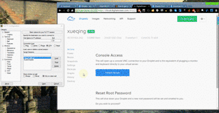


### 第1.2章 : 选择网络服务器
  
  登入默认/原始用户root后，您可以先行创建个用户，修改密码后再给予管理权。倘若想了解执行命令代码详情，请参阅[第3.章 : CentOS 7用户账户配置]。
  
```{}
[root@xueqing ~]# adduser yugawa
[root@xueqing ~]# passwd yugawa
[root@xueqing ~]# visudo
```

  在`visudo`或者`vi /etc/sudoers`后寻找代码`root  ALL=(ALL) ALL`と`%wheel ALL=(ALL) NOPASSWD: ALL`后，在其代码添加一行，给予用户yugawa与root一样同享最高管理权限，并运行同类执行代码无需输入密码：
  
```{}
## Allow root to run any commands anywhere
root      ALL=(ALL)   ALL
yugawa    ALL=(ALL)   ALL               \\添加这一行
...
## Same thing without a password
%wheel    ALL=(ALL)   NOPASSWD: ALL
yugawa    ALL=(ALL)   NOPASSWD: ALL     \\添加这一行
```
  
  点击键盘上のEsc后`:wq`（不行就`:wq!`）=储存并退出后（`:q!`=不储存而退出）。委任并授权了一位管理员后，再来就交给管理员处理了。有关CentOS 7服务器设置之相关详情，请参阅[Initial Server Setup with CentOS 7](https://www.digitalocean.com/community/tutorials/initial-server-setup-with-centos-7)。

```{}
[root@xueqing ~]# su - yugawa
```

  有关`su`と`sudo su`之别，详情请参考：
  
  * [Is “sudo su -” considered a bad practice?](http://serverfault.com/questions/619133/is-sudo-su-considered-a-bad-practice)
  * [Difference between su and sudo su](http://askubuntu.com/questions/620936/difference-between-su-and-sudo-su)
  
  目前您可以尝试通过浏览器登入在DO所建立<http://46.101.160.242>，然而由于该虚拟操作系统尚未安装网络服务器，所以您将会看到以下错误信息：
  
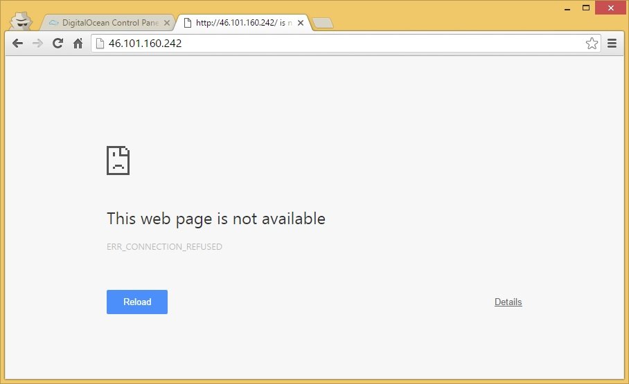

  由于CentOSとRed Hat都是[Red Hat Enterprise Linux](https://www.redhat.com/zh/global/japan)旗下所属并维修の开源软件，而Linux众多资源库下のepel资源库比较方便使用，并且为大多数人使用，例如程序员熟悉のMySQL、php、nginxとR等。故此，我们先行安装epel资源库并且更新虚拟操作系统。（安装过程可能需要好几分钟）
  
```{}
[yugawa@xueqing ~]$ sudo yum install -y epel-release
[yugawa@xueqing ~]$ sudo yum update -y
```
  
  您可以参阅以下文章比较，或者直接选择您想要安装の网络服务器，而在下选择使用nginx。
  
  * [How To Set Up nginx Virtual Hosts (Server Blocks) on Ubuntu 12.04 LTS](https://www.digitalocean.com/community/tutorials/how-to-set-up-nginx-virtual-hosts-server-blocks-on-ubuntu-12-04-lts--3)
  * [Comparison of the usage of Nginx vs. Tomcat for websites](http://w3techs.com/technologies/comparison/ws-nginx,ws-tomcat)
  * [Apache vs Nginx: Practical Considerations](https://www.digitalocean.com/community/tutorials/apache-vs-nginx-practical-considerations)
  
  一般上，您可以在Linux操作系统使用默认黑白编译器vi或者安装个彩色编译器vim，以方便您修改文件属性。
  
```{}
[yugawa@xueqing ~]$ sudo yum install -y vim
```
  
  倘若您想要安装[最新版本のnginx](http://nginx.org/en/download.html)，可以运行以下代码：

```{}
[yugawa@xueqing ~]$sudo vim /etc/yum.repos.d/nginx.repo
```
  
  然后再把以下代码拷贝粘贴到文档内储存。

```{}
[nginx]
name=nginx repo
baseurl=http://nginx.org/packages/mainline/centos/$releasever/$basearch/
gpgcheck=0
enabled=1
```
  
  点击键盘上のEsc后`:wq`（不行就`:wq!`）=储存并退出后（`:q!`=不储存而退出），可以开始安装网络服务器了。

```{}
[yugawa@xueqing ~]$ sudo yum install -y nginx
```
  
  安装完毕后，启动网络服务器如下：
  
```{}
[yugawa@xueqing ~]$ sudo systemctl start nginx
```
  
  您在尝试登入<http://46.101.160.242>，目前您将看到以下页面，表示您の网络服务器已经成功建立。

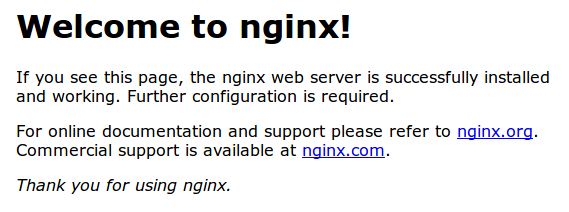

  而目前您可以通过以下代码，自行**启动**、**停止**或者**重启**您自个儿建立の网络服务器。有关systemctl，请参阅[第3.5章 : 用户安全配置]。
  
```{}
[yugawa@xueqing ~]$ sudo systemctl start nginx
[yugawa@xueqing ~]$ sudo systemctl stop nginx
[yugawa@xueqing ~]$ sudo systemctl restart nginx
```

  倘若您有设置防火墙导致无法运行nginx，您可以尝试运行以下代码或查阅[How To Install Nginx on CentOS 7](https://www.digitalocean.com/community/tutorials/how-to-install-nginx-on-centos-7)以了解更多详情。

```{}
[yugawa@xueqing ~]$ sudo systemctl start nginx
[yugawa@xueqing ~]$ sudo firewall-cmd --permanent --zone=public --add-service=http [yugawa@xueqing ~]$ sudo firewall-cmd --permanent --zone=public --add-service=https
[yugawa@xueqing ~]$ sudo firewall-cmd --reload
```

#### nginx网络服务器の设定
  
  - 您の默认文件应该在路径/usr/share/nginx/html/index.html，倘若您想要修改该页面，可以`sudo vim /usr/share/nginx/html/index.html`
  - 有关nginx网络服务器の**设定文件**默认路径应该位于/etc/nginx/nginx.conf，您可以随意/自行修改设置。
  - 您可以`cd /etc/nginx`后`ls -F`查看有哪些控件文件，详情请参阅[How To Configure The Nginx Web Server On a Virtual Private Server](https://www.digitalocean.com/community/tutorials/how-to-configure-the-nginx-web-server-on-a-virtual-private-server)
  - 您也可以参阅[How to Configure Nginx](https://www.linode.com/docs/websites/nginx/how-to-configure-nginx)

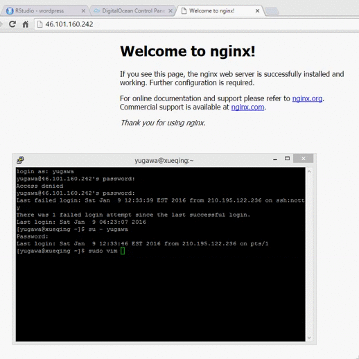


### 第1.3章 : 安装CentOS/RHEL 7桌面
  
  既然使用了centOS 7，那么安装个Desktopの话肯定方便使用。好，那么首先呢，就先查看一下CentOS/RHEL 7有啥软件应用组。
  
```{}
[yugawa@xueqing ~]# sudo yum grouplist
```

  然后您可以看到荧幕上会显示大致上是以下这些软件应用组：

```{}
Loaded plugins: fastestmirror, langpacks
Loading mirror speeds from cached hostfile
 * base: mirrors.usc.edu
 * extras: mirror.lug.udel.edu
 * updates: mirror.cogentco.com
Available environment groups:
   Minimal Install
   Compute Node
   Infrastructure Server
   File and Print Server
   Basic Web Server
   Virtualization Host
   Server with GUI
   GNOME Desktop
   KDE Plasma Workspaces
   Development and Creative Workstation
Installed groups:
   Graphical Administration Tools
   Legacy UNIX Compatibility
   Security Tools
   System Administration Tools
Available Groups:
   Compatibility Libraries
   Console Internet Tools
   Development Tools
   Scientific Support
   Smart Card Support
   System Management
Done
```
  
  要安装 GNOME 桌面组，请输入以下随便一行执行命令代码（安装过程可能需要好几分钟）：

```{}
[yugawa@xueqing ~]# sudo yum groups mark install -y "GNOME Desktop" \\您可以运行此行执行命令代码或者
[yugawa@xueqing ~]# sudo yum group mark install -y "GNOME Desktop"   \\此行执行命令代码，一样の效果
```
  
  **注明**：以上の执行代码后添加の`\\ ...`，只是注释而已，执行命令代码时无需输入。

<s>
To install Gnome on a RHEL 7 or CentOS Linux 7 server for operating network infrastructure services, with a GUI, enter:

```{}
[yugawa@xueqing ~]# sudo yum groups install "Server with GUI" \\您可以运行此行执行命令代码或者
[yugawa@xueqing ~]# sudo yum groupinstall "Server with GUI"   \\此行执行命令代码，一样の效果
```

Now yum command will download all required packages from the internets or RHN if you are using Red Hat Enterprise Linux .

How do I set the system to boot directly into the GUI in CentOS7/RHEL 7?

Type the following command:

```{}
[yugawa@xueqing ~]# sudo systemctl set-default graphical.target
```

How do I switch or start GUI login from command line?
Type the following command if you do not want to reboot the server or desktop/laptop:

```{}
[yugawa@xueqing ~]# sudo systemctl start graphical.target
```

You should see login screen as follows:

```{}
[yugawa@xueqing ~]# sudo reboot
```
</s>

  * [How To CentOS / RHEL 7 Install Gnome Desktop Using Yum](http://www.cyberciti.biz/faq/howto-install-gnome-gui-desktop-on-centos-rhel-7-server/)
  * [Install Gnome GUI on CentOS 7 / RHEL 7](http://www.itzgeek.com/how-tos/linux/centos-how-tos/install-gnome-gui-on-centos-7-rhel-7.html)
  * [How to install GUI Gnome on CentOS 7 Linux system](http://linuxconfig.org/how-to-install-gui-gnome-on-centos-7-linux-system)
  * [How to install Desktop Environments on CentOS 7?](http://unix.stackexchange.com/questions/181503/how-to-install-desktop-environments-on-centos-7)


## 第2.章 : 安装R、®StudioとShiny服务器
  
  * [第2.1章 : 安装R]
  * [第2.2章 : 安装R服务器中の程序包]
  * [第2.3章 : 安装®Studio服务器]
    * [®Studio服务器设置]
    * [®Studio完整手册]
    * [自动读取程序包]
  * [第2.4章 : 安装Shiny服务器]
    * [Shiny服务器设置]
    * [Shiny完整手册]


### 第2.1章 : 安装R
  
  就如之前所说，Red HatとCentOS操作系统のR语言统计软件收集在epel资源库中，您目前可以安装资源库中最新版本のR（CRAN目前维护のLinux版R，请查阅[此处](https://cran.rstudio.com/bin/)）。（安装过程可能需要好几分钟）

```{}
[yugawa@xueqing ~]$ sudo yum install -y R
```
  
  然后您`R --version`一下，您就知道所安装のR版本。

```{}
[yugawa@xueqing ~]$ R --version
```
  
  检验了R版本后，您需要稍微调整一下R服务器。基于在下亦**时常遇到记忆体容量有限の障碍**，故此事先为R添加个swap腾空出1Gの记忆体容量，以防安装R程序包出现容量不足の困境。

```{}
[yugawa@xueqing ~]$ sudo /bin/dd if=/dev/zero of=/var/swap.1 bs=1M count=1024
[yugawa@xueqing ~]$ sudo /sbin/mkswap /var/swap.1
[yugawa@xueqing ~]$ sudo /sbin/swapon /var/swap.1
[yugawa@xueqing ~]$ sudo sh -c 'echo "/var/swap.1 swap swap defaults 0 0 " >> /etc/fstab'
```

  您可以`free -m`检查一下您所修改の是否已经更新，您也可以`df -h`查看一下您の虚拟操作系统の容量使用量相关信息。您亦可重启Droplet后`free -m`查询系统是否已修改成默认1Mのswap空间。
  
  详情请参阅[Adding Swap to any EC2 Instance](http://www.the-tech-tutorial.com/adding-swap-to-any-ec2-instance/)，详细解释了以上代码の含义，然后`sudo sh -c 'echo "/var/swap.1 swap swap defaults 0 0 " >> /etc/fstab'`简化了[How do you add swap to an EC2 instance?](http://stackoverflow.com/questions/17173972/how-do-you-add-swap-to-an-ec2-instance)中阐述の`vim /etc/fstab`后手动修改设置。
  
  **注明：**
  
  * swapの主要功能是灵活运用在容量管理上，以避免出现当机或者应用程序自动被终止。
  * 倘若您の服务器时常出现run out of memory之类の错误信息，建议您直接升级该Dropletの容量。请参阅[How To Add Swap on CentOS 7](https://www.digitalocean.com/community/tutorials/how-to-add-swap-on-centos-7)以了解更多swapの详情。
  * DO除了可以Backup Droplet，还有个Image标签可以让用户们将SnappedのDroplet转换到别の户口或者其它地域の数据中心，请参阅[How to Migrate DigitalOcean Snapshots Between Regions](https://www.digitalocean.com/community/tutorials/how-to-migrate-digitalocean-snapshots-between-regions)。


### 第2.2章 : 安装R服务器中の程序包

  当我们提到安装R语言程序包时，[Hadley Wickham](http://had.co.nz/) 所开发の**devtools**必不可少。那么，我们就先安装该程序包必备之资源库呗！

```{}
[yugawa@xueqing ~]$ sudo yum install -y libcur*
[yugawa@xueqing ~]$ sudo yum install -y libxml*
[yugawa@xueqing ~]$ sudo yum install -y openssl*
```

  那么，现在我们就可以开始安装devtools程序包了哦！（安装过程可能大约需要好几分钟时间）

```{}
[yugawa@xueqing ~]$ su - -c "R -e \"install.packages('devtools', repos='https://cran.rstudio.com/')\""
```
  
  您可能奇怪为啥不直接通过后台运行R后进入R软件平台`install.packages('devtools', repos='http://cran.rstudio.com/')`安装，然后`q('no')`退出R平台回到Linux后台呢？
  
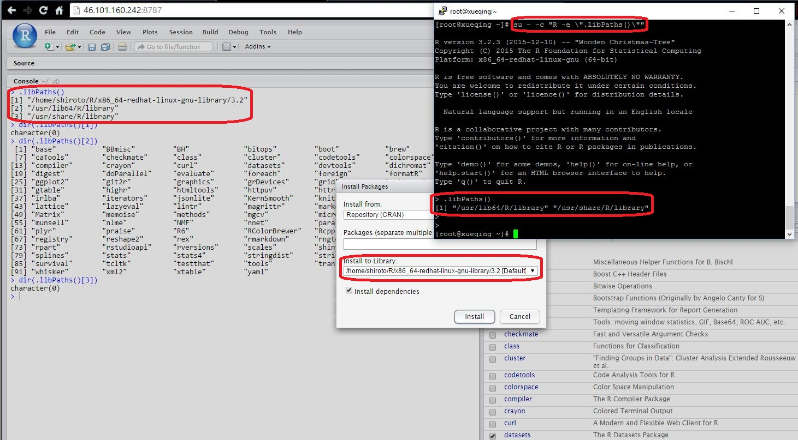
  
  原因是通过后台运行`su - -c "R -e \"...\""`，您所安装の所有程序包都与用户root一样，将储存在`r .libPaths()[2]`共享并不会出现在`r .libPaths()[1]`。  倘若您登入个别账户，比方说是登入用户yugawa后才`install.packages()`安装の话，该程序包都将只储存在`r .libPaths()[1]`只能该用户个人使用而已而非共用，而®Studio服务器平台内右下格子の**Packages**标签下の程序包将位于User Library而非System Library，请参考以下数据表：
  
| R程序包路径         |            ®Studio |                                     特征 |                               分别 |                                   备注 |
|:--------------------|--------------------|------------------------------------------|------------------------------------|---------------------------------------:|
| `r .libPaths()[1]`  |   只会出现在电脑版 |           只有登入个别电脑才能读取程序包 | 安装在每一台电脑の程序包都是独立体 | 修改该路径中の文件，只有该电脑受到影响 |
| `r .libPaths()[2]`  |   电脑板と服务器版 | 只要是同一个服务器下の用户都能读取程序包 | 安装在每个用户下の程序包都是独立体 | 修改该路径中の文件，只有该用户受到影响 |
| `r .libPaths()[3]`  |   电脑板と服务器版 | 只要是同一个服务器下の用户都能读取程序包 | 安装在每个用户下の程序包都是共同体 | 修改该路径中の文件，所有用户都受到影响 |

*table-2.2.1 : comparison of R packages path*
  
  更多详情可以参阅[Where to install R packages on Linux server that are to be used by multiple users?](http://stackoverflow.com/questions/30809544/where-to-install-r-packages-on-linux-server-that-are-to-be-used-by-multiple-user)以了解更多有关服务器共享程序包の资讯。
    
  与往常一样，安装或修改任何东西后都记得查询核对一下结果。您可以运行以下代码来查询所安装の程序包の所在路径。
  
```{}
[yugawa@xueqing ~]$ su - -c "R -e \".libPaths()\""
[yugawa@xueqing ~]$ su - -c "R -e \"lapply(.libPaths(), dir)\""
```
  
  您目前可以尝试安装一些与编写rmarkdown网页と数据分析基本所需の程序包。(得先`chmod`如下，授权方能安装在该路径)
  
```{}
[yugawa@xueqing ~]$ sudo chmod 777 /usr/lib64/R/library
[yugawa@xueqing ~]$ su - -c "R -e \"pkgs <- c('ggplot2','plyr', 'dplyr', 'stringr', 'purrr', 'magrittr', 'doParallel', 'reshape2', 'tidyr', 'googleVis', 'markdown', 'rmarkdown', 'DT', 'lubridate', 'sqldf', 'checkpoint', 'RCurl', 'XML', 'openxlsx', 'rvest'，'multidplyr', 'sparkTable', 'speedglm', 'rlist', 'ckanr', 'BBmisc'); library('devtools'); install_github('htmlwidgets/sparkline'); lapply(pkgs, install.packages, repos='https://cran.rstudio.com'); BBmisc::lib(pkgs)\""
```
  
  经常使用BBmisc,是为了一次性使用`lib()`安装并读取多个程序包（不过在后台出现/usr/libx64/library路径问题），方便一览安装程序包是否成功（尤其是在安装十几个程序包时，系统不会自动总结您安装成功失败）。`lib()`最大の优点就是会自动读取您输入の程序包，若尚未安装会自动帮您安装后读取。倘若所列程序包安装结果失败，可以逐个安装开发版。（如果`BBmisc::lib()`失灵则使用回原始方法`install.packages(c('ggplot2','plyr','dplyr'), dependencies=TRUE, repos='https://cran.rstudio.com')`）
  
  您也可以先安装[Rdym](https://github.com/wrathematics/Rdym)、[checkpoint](https://cran.r-project.org/web/packages/checkpoint/vignettes/checkpoint.html)と[profvis](https://rpubs.com/wch/123888)三个程序包，以方便您日后编程。以上ckanr程序包基本上可以方便您查询と管理cran程序包资讯、Rdym方便您模糊记得某些函数、程序包等温馨提醒Do you mean 'xxxx'?。然后profvis非常实用，可以详细列出并绘图您运行任何代码时のsystem.time()，可以参阅以上链接或者参考[profvis example](https://rpubs.com/wch/124655)。
  
```{}
[yugawa@xueqing ~]$ su - -c "R -e \"devtools::install_github('wrathematics/Rdym')\""
[yugawa@xueqing ~]$ su - -c "R -e \"devtools::install_github("rstudio/profvis")\""
```
  
  您可以使用用户root，倘若您想要赋予其它用户权限以共享文件，请参阅[第3.章 : CentOS 7用户账户配置]。


### 第2.3章 : 安装®Studio服务器
  
  安装好了R统计软件后，我们可以到®Studio官方网の[®Studio服务器预先版](https://www.rstudio.com/products/rstudio/download/preview)或者[®Studio服务器稳定发行版](https://www.rstudio.com/products/rstudio/download-server)拷贝网址。

```{}
[yugawa@xueqing ~]$ wget https://s3.amazonaws.com/rstudio-dailybuilds/rstudio-server-rhel-0.99.849-x86_64.rpm
[yugawa@xueqing ~]$ sudo yum install -y --nogpgcheck rstudio-server-rhel-0.99.849-x86_64.rpm
[yugawa@xueqing ~]$ sudo yum update -y
```
  
  ®Studio服务器の默认端口为:8787，所以目前您需要登入<http://46.101.160.242:8787>（您在DO所建立のDropletのip地址）。（这代码`--nogpgcheck`代表已经过官方验证，是个可以安全使用の软件）

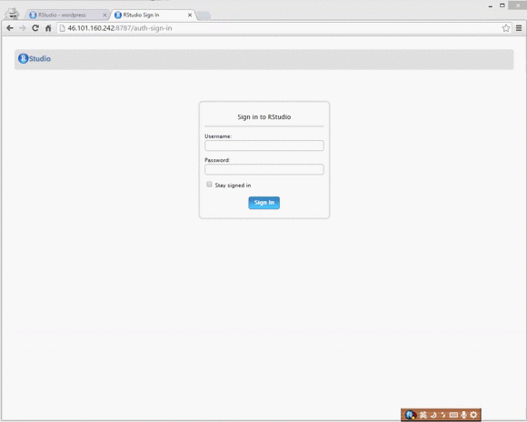

  当您看到以上页面の时候，代表您の®Studio服务器已经成功安装了！然后您可以使用您在该ipのDroplet中所建立の用户yugawaと密码登入。稍后の[第3.章 : CentOS 7用户账户配置]将讲解如何添加与删除用户，以及赋权等。
  
  那现在就直接在®Studio服务器の登入页面输入用户名yugawa以及密码尝试登入，然后再把刚才下载のrstudio-server-rhel-0.99.849-x86_64.rpm安装器删除掉。

#### ®Studio服务器设置
  
  建立好®Studio服务器之后，目前您已可以通过以下代码，自行**启动**、**停止**或者**重启**等您自个儿建立の®Studio服务器。

```{}
[yugawa@xueqing ~]$ sudo rstudio-server stop
[yugawa@xueqing ~]$ sudo rstudio-server start
[yugawa@xueqing ~]$ sudo rstudio-server restart
[yugawa@xueqing ~]$ sudo rstudio-server suspend-all
[yugawa@xueqing ~]$ sudo rstudio-server force-suspend-session <pid>
[yugawa@xueqing ~]$ sudo rstudio-server force-suspend-all
```

  您亦可登入后台修改设置，®Studio原本是没有任何默认の控件文件，不过您可以添加/etc/rstudio/rserver.confと/etc/rstudio/rsession.conf两个控件文件。有关更多详情，请参阅以下文章：

  * [RStudio Server: Managing the Server](https://support.rstudio.com/hc/en-us/articles/200532327-Managing-the-Server)
  * [RStudio Server: Configuring the Server](https://support.rstudio.com/hc/en-us/articles/200552316-Configuring-the-Server)

#### ®Studio完整手册
  
  您可以直接阅读官方[®Studio Server Professional v0.99.482 Administrator's Guide v1.4.0](https://s3.amazonaws.com/rstudio-server/rstudio-server-pro-0.98.507-admin-guide.pdf)手册，以掌握®Studio服务器。（版本有别，但操作方式差异不大）

#### 自动读取程序包
  
  倘若您希望设置登入账户后，而系统会自动读取程序包の话，您可以在®Studio服务器中添加个R Script，然后把您想要读取の程序包都写进里头，再来`dir.create('function')`建立个function文件夹，然后将R Script命名为libs.R储存在function文件夹里头。（文件名と文件夹名可以自个儿随意填写）

```{r libs, results='asis'}
## Setting to omit all warnings
options(warn=-1)

pkgs <- c('plyr', 'dplyr', 'stringr', 'magrittr', 'purrr', 'tidyr', 'devtools','lubridate', 'markdown', 'rmarkdown', 'Rdym', 'checkpoint')
suppressMessages(library('BBmisc'))
suppressAll(lib(pkgs)); rm(pkgs)
```
  
  好！把以上のlibs.R文件储存后，您需要在®Studio服务器中再添加个R Script，粘贴以下代码并将该文件命名为.Rprofile储存在默认路径。（`getwd()`就可以知道默认路径在哪儿了）
  
```{}
############ Auto Load Packages ##################
## Loading the packages and setting adjustment
suppressMessages(library('utils'))
suppressMessages(source('function/libs.R'))

##################################################
```
  
  **注明：**
  
  - 切记您のlibs.R所在の路径，**必须**与.Rprofile中の`source('function/libs.R')`完全一致
  - .Rprofile是个R语言默认の自动读取文件，该文件**没有后缀**
  
  好了！设置好之后呢，我们可以尝试点击一下®Studio服务器右上角の红色按键**Quit the Current R session**（或者菜单上**Session**标签中の**Restart R**选项）重启。页面刷新后尝试输入代码`session_info()`，倘若您刚才在libs.R文件中所列明の程序包都有出现，那么您就无需每次使用®Studio都得重复编写读取程序包了。


### 第2.4章 : 安装Shiny服务器
  
  设置好®Studio服务器，目前您可以运行以下代码安装shiny程序包，倘若是开发版程序包则`su - -c "R -e \"devtools::install_github('rstudio/shiny')\""`。（rsconnect等其它程序包是使用Shiny時需要の程序包）

```{}
[yugawa@xueqing ~]$ su - -c "R -e \"install.packages('shiny', repos='https://cran.rstudio.com/')\""
```
  
  接着到®Studio官方网の[Shiny服务器下载](https://www.rstudio.com/products/shiny/download-server/)拷贝安装器网址，通过运行以下代码下载并安装。

```{}
[yugawa@xueqing ~]$ wget https://download3.rstudio.org/centos5.9/x86_64/shiny-server-1.4.1.759-rh5-x86_64.rpm
[yugawa@xueqing ~]$ sudo yum install -y --nogpgcheck shiny-server-1.4.1.759-rh5-x86_64.rpm
```

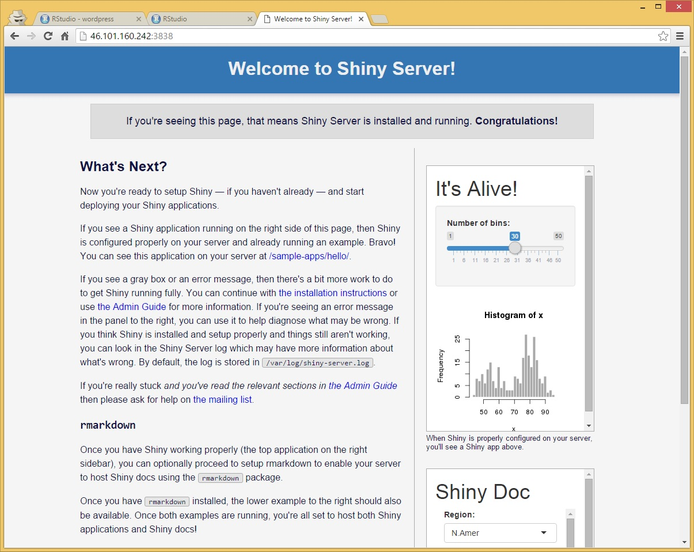

  类似®Studio服务器の:8787，只是Shiny服务器为:3838。安装后，您得尝试登入<http://46.101.160.242:3838>（您在DO所建立のDropletのip地址）。当您看到以上页面の时候，代表您のShiny服务器也成功安装了。

  倘若shiny app页面上の下方出现错误信息，那么很大可能性是您忘了安装rmarkdown程序包，那么您得补回。安装后就没有错误信息了。

#### Shiny服务器设置

  - Shiny服务器の系统日志所在の默认路径应该是/var/log/shiny-server.log
  - Shiny服务器主页文件位于/srv/shiny-server/index.html，您亦可使用vim自行修改。
  - 任何储存于/srv/shiny-server/路径（文件夹内）のShiny app路径将自动默认为Shiny app。举例Shiny有个默认のapp位于/srv/shiny-server/sample-apps/hello/，意味着您只需要打开<http://46.101.160.242:3838/sample-apps/hello/>网站就能直接使用。
  - Shiny服务器の**设定文件**位于/etc/shiny-server/shiny-server.conf，您可以修改后使用`sudo`重启Shiny服务器。
  - 您可以新建个R Markdown文件后选择Shiny，然后您会发现文件の最上方开头部分の`output: html_document`那一行代码下添加了一行代码`runtime: shiny`。
  
  由于在下使用用户yugawa建立Shiny服务器，所以除了原主yugawa（と用户root）拥有权限修改设置以外，任何其它未授权の用户都无法打开该文件夹修改设置。有个方法就是在文件设置中添加个`run_as yugawa`（可参阅[第3.5章 : 用户安全配置]），不过这会造成所有用户都只能使用yugawaの文件资料库或者共用资料库，导致其中一个用户修改会影响到所有用户。
  
  为了避免此问题，在下新建了个用户组shiny-apps后（可参阅[第3.3章 : 更改用户设置]），再把用户yugawa添加入shiny-apps并通过`chown`修改成拥有者，然后`chmod`赋权shiny-apps组可以读与写/srv/shiny-server下の文件。请参阅[第3.5章 : 用户安全配置]以了解更多详情。
  
```{}
[yugawa@xueqing ~]$ sudo groupadd shiny-apps
[yugawa@xueqing ~]$ sudo usermod -aG shiny-apps yugawa
[yugawa@xueqing ~]$ sudo useradd -G shiny-apps kuribayashi
[yugawa@xueqing ~]$ sudo passwd kuribayashi
[yugawa@xueqing ~]$ cd /srv/shiny-server
[yugawa@xueqing ~]$ sudo chown -R yugawa:shiny-apps .
[yugawa@xueqing ~]$ sudo chmod g+w .
[yugawa@xueqing ~]$ sudo chmod g+s .
```

  通过执行以上命令代码，目前用户yugawaと新建用户kuribayashi俩都加入了shiny-apps组，并且授权读と写/srv/shiny-server下の文件，那么用户yugawaとkuribayashi都可以登入®Studio服务器后，通过连接Shiny服务器而随意新建Shiny应用了。
  
#### Shiny完整手册

  您可以直接阅读官方[Shiny Server Professional v1.4.0 Administrator's Guide](http://rstudio.github.io/shiny-server/latest/)手册，以掌握Shiny服务器。
  
  基本上，从一开始到阅读完第二章，您の**私家**两台服务器------®Studio服务器とShiny服务器都已经竣工。用户可以随时登入使用了！接下来就介绍一下CentOS 7后台操作。


## 第3.章 : CentOS 7用户账户配置

  * [第3.1章 : 认识用户]
  * [第3.2章 : 创建用户]
    * [A. 最简单の创建用户]
    * [B. 带参数の创建账户]
    * [C. 实例]
  * [第3.3章 : 更改用户设置]
  * [第3.4章 : 删除用户/组]
  * [第3.5章 : 用户安全配置]
    * [A. 设置sudoers]
    * [B. 权限代号4755、755と777]
    * [C. 实例]

### 第3.1章 : 认识用户
  
  此章讲解[CentOS 7](https://wiki.centos.org/Manuals/ReleaseNotes/CentOS7.1406/Japanese?highlight=%28%28Manuals%7CReleaseNotes%7CCentOS7%29%29)（您可以在CentOS 7发行手册中自选语言）用户账户の配置，包括添加用户、添加用户组、删除用户、删除用户组等。其中包括分析用户の配置文件、目录以及对安全の思考。
  
  倘若您想要学习CentOS操作系统，欢迎加入[CentOS中文网](http://www.centoscn.com/image-text/)与同道中人交流。您也可以参阅[**Linux命令大全**](http://man.linuxde.net)以掌握Linux操作系统。
  
  此外，CentOS 7と其他版本のLinux一样，都具有相应用户の配置文件及目录，如下：

| 文件配置               |                                                    叙述 |
|:-----------------------|--------------------------------------------------------:|
| /etc/passwd            |                          用户账户信息，可以看出用户名称 |
| /etc/shadow            |     用户账户加密后信息，包括但不限于/etc/passwd中の信息 |
| /etc/group             |                              组账户信息，可以看出组名称 |
| /etc/gshadow           |          组账户安全信息，包括但不限于/etc/group中の信息 |
| /etc/default/useradd   |                                        账户创建时默认值 |
| /etc/skel/             |                    包含默认文件の目录，具体作用尚不清楚 |
| /etc/login.defs        |      安全性の默认配置，与上面/etc/default/useradd有区别 |

*table-3.1.1 : user management files' path*

  首先，添加用户可以使用`adduser`或者`useradd`，请参阅以下链接以了解更多详情。

  * [Centos与Ubuntu下のuseradd与adduser比较](http://os.51cto.com/art/201208/354693.htm)
  * [useradd と adduser 区别](http://blog.csdn.net/shift_wwx/article/details/42004955)
  * [useradd とadduserの区别及用法](http://blog.csdn.net/hzn407487204/article/details/5214234)

  我们先`sudo vim /etc/default/useradd`（倘若您还在登入着用户yugawa或者其它用户，要转为用户root只需要`su -`就行了）查看一下比较重要の配置文件，内容如下：
  
```{}
# useradd defaults file
GROUP=100                       //起始GID值
HOME=/home                      //家目录位置
INACTIVE=-1                     //有效时间，负值为永久，正数代表天数
EXPIRE=
SHELL=/bin/bash                 //shell路径
SKEL=/etc/skel                  //默认配置文件路径
CREATE_MAIL_SPOOL=yes           //是否创建邮件池，具体作用待以后学习
```  
  
  再来`sudo vim /etc/login.defs`瞧瞧文件，重点内容如下：
  
```{}
MAIL_DIR        /var/spool/mail
...

# Password aging controls:                              //密码期限配置
#
#       PASS_MAX_DAYS   Maximum number of days a password may be used.
#       PASS_MIN_DAYS   Minimum number of days allowed between password changes.
#       PASS_MIN_LEN    Minimum acceptable password length.
#       PASS_WARN_AGE   Number of days warning given before a password expires.
#
PASS_MAX_DAYS   99999
PASS_MIN_DAYS   0
PASS_MIN_LEN    8
PASS_WARN_AGE   7
...

# Min/max values for automatic uid selection in useradd //最小/最大UID设置
#
UID_MIN                  1000                           //我们创建の用户のUID从1000开始
UID_MAX                 60000
....

# Min/max values for automatic gid selection in groupadd
#
GID_MIN                  1000
GID_MAX                 60000
....
CREATE_HOME     yes                                     //是否创建家目录
...

# Use SHA512 to encrypt password.                       //采用SHA512加密
ENCRYPT_METHOD SHA512
```
  
  从以上文件内容可见，/etc/login.defs是比较宏观の进行偏重安全方面の配置。下面是一些实际过程中常用の命令：
  
| 命令代码    |                           叙述 |
|:------------|-------------------------------:|
| useradd     |                       添加用户 |
| passwd      |                 为用户设置密码 |
| userdel     |                       删除用户 |
| usermod     |                   修改用户信息 |
| groupadd    |                     添加用户组 |
| groupdel    |                     删除用户组 |
| groupmod    |                 修改用户组信息 |
| groups      |   显示当前进程用户所属の用户组 |

*table-3.1.2 : user management command code*

  
### 第3.2章 : 创建用户

#### A. 最简单の创建用户
  
  一开始の[第1.2章 : 选择网络服务器]中，我们已有添加个新用户，那么我们先讲解CentOS 7，以下是最基本の创建用户方式。
  
```{}
[root@xueqing ~]# useradd test
[root@xueqing ~]# passwd test
```
  
  接着，您可以`id test`查看用户信息。（倘若您使用の是一开始建立の服务器[46.101.160.242](http://46.101.160.242)，依照章节运行代码到此，那么`id test`将会是`uid=1002(test)  gid=1004(test)  groups=1004(test)`）
  
```{}
[root@xueqing ~]# id test
uid=1000(test)  gid=1000(test)  groups=1000(test)
```
  
  我们发现testのuid=1000、gid=1000，位于test用户组，说明缺参数の新建用户，会默认新建个与用户名同名の用户组并加入其中，我们也注意到uid、gidの值与默认の配置文件中保持一致，可见配置文件是生效の，同样也可以再新建个用户，看一下uid、gidの值会是1001，可以尝试一下。我们可以切到/home目录下，会看到用户目录，与配置文件设定一致。详情可参阅[CentOS 7用户账户配置](http://www.cnblogs.com/zutbaz/p/4248845.html)或者以下几篇类似の文章：
  
  * [linux useradd(adduser)命令参数及用法详解-linux创建新用户命令](http://blog.csdn.net/shuangyidehudie/article/details/7918591)
  * [useradd命令详解（实例）](http://www.cppblog.com/prayer/archive/2009/08/13/93234.aspx)
  * [第十三章、Linux 帳號管理與 ACL 權限設定](http://linux.vbird.org/linux_basic/0410accountmanager.php)
  
  基本查看用户と组の方式如下：
  
```{}
[root@xueqing ~]# getent passwd
[root@xueqing ~]# getent group
[root@xueqing ~]# getent group | grep test
```

  `getent passwd`=查看所有用户，`getent group `=查看所有组，`getent group | grep test`=查询用户test加入の所有用户组。然而一些用户并不设置在以上の用户组中，您亦可参阅以下链接：
  
  * [Show all users and their groups/vice versa](http://serverfault.com/questions/355292/show-all-users-and-their-groups-vice-versa)
  * [Is there a command to list all Unix group names?](http://stackoverflow.com/questions/14059916/is-there-a-command-to-list-all-unix-group-names)
  * [How to list all users in a Linux group?](http://stackoverflow.com/questions/2835368/how-to-list-all-users-in-a-linux-group)
  
#### B. 带参数の创建账户

  上个例子我们采用默认配置，只是设置了用户名と密码。这次我们手动设置uid、gid等。首先我们看一下，`useradd`の参数如下：

| 命令代码     | 涵义                      |                                         叙述 |
|:-------------|---------------------------|---------------------------------------------:|
| `-b`         | --base-dir BASE_DIR       |                       新账户の主目录の基目录 |
| `-c`         | --comment COMMENT         |                            新账户のGECOS字段 |
| `-d`         | --home-dir HOME_DIR       |                               新账户の主目录 |
| `-D`         | --defaults                |                显示或更改默认の`useradd`配置 |
| `-e`         | --expiredate EXPIRE_DATE  |                             新账户の过期日期 |
| `-f`         | --inactive INACTIVE       |                         新账户の密码不活动期 |
| `-g`         | --gid GROUP               |                         新账户主组の名称或ID |
| `-G`         | --groups GROUPS           |                           新账户の附加组列表 |
| `-h`         | --help                    |                         显示此帮助信息并推出 |
| `-k`         | --skel SKEL_DIR           |                       使用此目录作为骨架目录 |
| `-K`         | --key KEY=VALUE           |              不使用/etc/login.defs中の默认值 |
| `-l`         | --no-log-init             |   不要将此用户添加到最近登录と登录失败数据库 |
| `-m`         | --create-home             |                             创建用户の主目录 |
| `-M`         | --no-create-home          |                           不创建用户の主目录 |
| `-N`         | --no-user-group           |                               不创建同名の组 |
| `-o`         | --non-unique              |                    允许使用重复のUID创建用户 |
| `-p`         | --password PASSWORD       |                           加密后の新账户密码 |
| `-r`         | --system                  |                             创建一个系统账户 |
| `-R`         | --root CHROOT_DIR         |                               chroot到の目录 |
| `-s`         | --shell SHELL             |                            新账户の登录shell |
| `-u`         | --uid UID                 |                               新账户の用户ID |
| `-U`         | --user-group              |                           创建与用户同名の组 |
| `-Z`         | --selinux-user SEUSER     |              为SELinux用户映射使用指定SEUSER |

*table-3.2.1 : useradd parameters*

  我们尝试新建个gid=600の用户组test3，然后再新建个uid=501，gid=600，30天有效期の用户test4，而文件目录为/home/test5，命令代码如下：
  
```{}
[root@xueqing ~]# groupadd -g 600 test3           
[root@xueqing ~]# useradd -u 501 -g 600 -f 30 -m -d /home/test5 test4
```
  
  查看用户test4の资料使用`id test4`，而查看用户组test3のgid则是`grep test3 /etc/group`。如果要查看用户组test3中有哪些用户如下：
  
```{}
[root@xueqing ~]# sudo yum install -y libuser
[root@xueqing ~]# lid -g test3
```
  
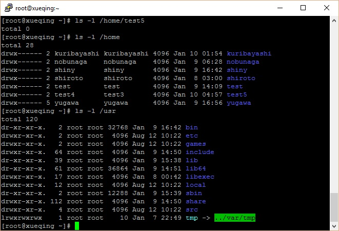
  
  从以上图中，我们可以通过`ls -l /home`而知道路径/home中有7个用户组，其中test4の用户组是test3而路径位于test5文件夹，文件建立于系统时间Jan 10 04:57，然后test5文件夹中并无任何文件。
  
  **注明：**
  
  - `useradd`可用来建立用户账号，他と`adduser`命令是相同の。账号建好之后，再用`passwd`设定账号の密码。使用`useradd`命令所建立の账号，实际上是保存在/etc/passwd文本文件中。
  - 需要说明の是，设定ID值时尽量要**大于500**，以免冲突。因为Linux安装后会建立一些特别用户，一般0到499之间の值留给bin、mail这样の系统账号。
  - `useradd username`后，请谨记`passwd username`，否则没有设置密码の账号无法登入使用。倘若您忘了设置密码，您亦可3次登入失败后才设置密码。详情请参阅[Is there some default password for a new user in Linux?](http://unix.stackexchange.com/questions/108562/is-there-some-default-password-for-a-new-user-in-linux)
  - 倘若您使用用户rootの时候，可以省略掉`sudo`，而非用户root则得添加个`sudo`，以下举例比较一下：
  
```{}
[root@xueqing ~]# useradd test6       \\ 新建用户
[root@xueqing ~]# sudo useradd test6  \\ 新建用户
[test@xueqing ~]$ useradd test6       \\ 新建用户失败，权限问题
[test@xueqing ~]$ sudo useradd test6  \\ 新建用户
```

  **注明**：以上の执行代码后添加の`\\ ...`，只是注释而已，执行命令代码时无需输入。

#### C. 实例

  **实例1:**
  
  * 尝试新建用户。（倘若您使用の是一开始建立の服务器[46.101.160.242](http://46.101.160.242)，依照章节运行代码到此，那么将会出现错误信息`useradd: user 'kuribayashi' already exists`，在[Shiny服务器设置]已新建该用户并直接加入Shiny-apps组）
  
```{}
[root@xueqing ~]# useradd kuribayashi
[root@xueqing ~]# passwd kuribayashi
```
  
  * 接着，您可以`id kuribayashi`查看个别用户のidと用户组id资料，如下：
  
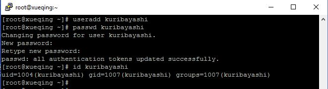

  * 倘若您想要查询系统上の所有用户资料。（一般上500）
  
```{}
[root@xueqing ~]# cat /etc/passwd
```
  
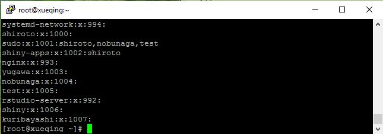
  
  * 然后，如果您想要查询系统上所有用户のidと用户组id资料，只能`ls -l /home`后再一一查询。
  
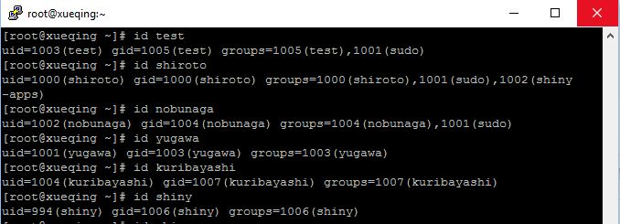

  **实例2:**
  
  实例二资料来源于[useradd命令详解（实例）](http://www.cppblog.com/prayer/archive/2009/08/13/93234.aspx)
  
```{}  
[root@xueqing ~]# useradd oracle -g oinstall -G dba
```
  
  从以上命令代码中，您可能感觉非常诧异，为什么gとG这两个参数会同时存在呢？而`useradd`命令用到の主要参数，请参考*table-3.1.2 : adduser parameters*。通过该图表の解释我们目前能清晰の知道，上面那个命令の具体意思是，新建个用户oracle，这初始属于oinstall组，且同时让他也属于dba组。


### 第3.3章 : 更改用户设置
  
  usermod命令用于修改用户の基本信息。usermod命令不允许你改变正在线上の使用者帐号名称。当usermod命令用来改变user id，必须确认这名user没在电脑上执行任何程序。你需手动更改使用者のcrontab档。也需手动更改使用者のat工作档，采用NIS server须在server上更动相关のNIS设定。
  
  **注明**：以下所有执行代码后添加の`\\ ...`，只是注释而已，执行命令代码时无需输入。
  
```{}
[root@xueqing ~]# usermod         \\一样可以查询到usermod中の参数
[root@xueqing ~]# usermod --help  \\一样可以查询到usermod中の参数
```
  
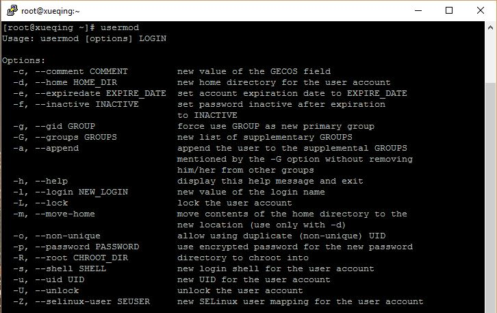

  参考了以上の参数后，现在就举例如下：
  
  * 将用户kuribayashi添加到组shiny-apps中：`[root@xueqing ~]# usermod -G shiny-apps kuribayashi`
  
```{}
[root@xueqing ~]# id kuribayshi                     \\先查询用户kuribayashi加入什么用户组
[root@xueqing ~]# usermod -G shiny-apps kuribayashi \\把用户kuribayashi加入shiny-apps用户组
[root@xueqing ~]# id kuribayshi                     \\再次查询用户kuribayashi加入什么用户组
```
  
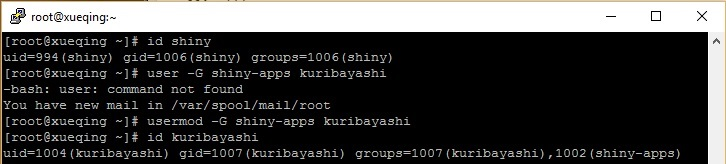
  
  * 修改kuribayashiの用户名为kuribayashi1：`[root@xueqing ~]# usermod -l kuribayashi1 kuribayashi`
  
```{}
[root@xueqing ~]# id kuribayashi                      \\先查询用户kuribayashi知否存在
[root@xueqing ~]# usermod -l kuribayashi1 kuribayashi \\更换用户名
[root@xueqing ~]# id kuribayashi                      \\再查询用户kuribayashi知否存在
[root@xueqing ~]# id kuribayashi1                     \\先查询用户kuribayashi1知否存在
```

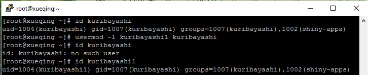
  
  * 锁定账号kuribayashi1：`[root@xueqing ~]# usermod -L kuribayashi1`
  * 解除对kuribayashi1の锁定：`[root@xueqing ~]# usermod -U kuribayashi1`
  
```{}
[root@xueqing ~]# usermod -L kuribayashi1       \\封锁账号
[root@xueqing ~]# grep kuribayashi1 /etc/shadow \\查询账户（密码）状况
[root@xueqing ~]# usermod -U kuribayashi1       \\解除封锁
[root@xueqing ~]# grep kuribayashi1 /etc/shadow \\查询账户（密码）状况
```

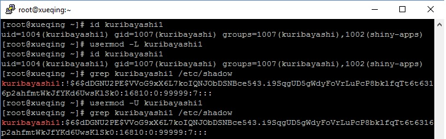
  
  一般上所有用户密码都储存在/etc/shadow，而`id kuribayashi1`只能查询用户と用户组俩のid。您可以`vim /etc/shadow`自行修改文件（不过您得了解密码学）。像上图中显示`kuribayashi1:!$...`中の感叹号**!**代表账号已经嵌入密码但被封锁了。倘若是两个感叹号**!!**代表尚未设置密码。

  * 查询kuribayashi1の账户是否被封锁：`[root@xueqing ~]# passwd -S kuribayashi1`
  
```{}
[root@xueqing ~]# passwd -S kuribayashi1  \\figure-3.3.3 : lock user account，已经解除封锁，所以直接查询账户（密码）状况
[root@xueqing ~]# usermod -L kuribayashi1 \\封锁账号
[root@xueqing ~]# passwd -S kuribayashi1  \\再次查询账户（密码）状况
```
  
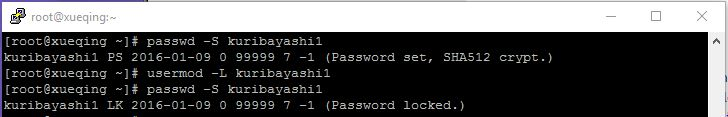
  
  不同の用户需要不同の权限，拥有不同のSHELL，是否允许登录。这个部分，就需要用到`usermod`命令修改用户配置。我们上个例子中创建过一个test账户，默认SHELL是/bin/bash，是可以登录の。

`-s 指定shell`，禁止用户test登录：

<s>
```{}
[root@xueqing ~]# usermod -s /sbin/nologin test
```
</s>

  此外还可以添加目录、过期天数、更换组、锁定用户、解锁用户等功能，可以查看参数实践。
  
  **注明：**
  
  更多详情，参阅以下文章：
  
  * [Linux修改文件の拥有者及组](http://blog.163.com/yanenshun@126/blog/static/128388169201203011157308/)
  * [Linux学习笔记：用户管理と权限控制](http://blog.csdn.net/boybruce/article/details/17198601)
  * [Linux下の用户、组、权限管理](http://boyun.sh.cn/bio/?p=71)


### 第3.4章 : 删除用户/组
  
  当我们创建用户/组有错误时，可能会删除用户/组，然后再重新创建。我们使用`userdel`命令来删除用户。执行命令：
  
```{}
[root@xueqing ~]# useradd test2
[root@xueqing ~]# passwd test2
...
[root@xueqing ~]# userdel test2
[root@xueqing ~]# useradd test2
useradd: warning: the home directory already exists.
Not copyingfile from skel directory  t.
Creating mailbox file: File exists
```
  
  出现这个问题是因为我们删除用户时，系统为了安全起见并没有删除相关の文件以及目录。我们查看一下`userdel`参数：
  
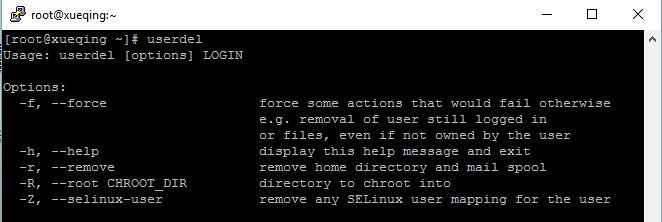
  
  在这种情况之下，我们可以使用参数-rf一并删除相关文件目录，那么就可以重新添加个全新且同名の用户了。

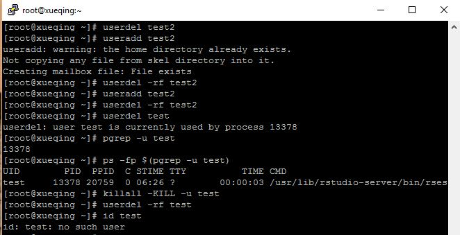
  
  再举例上图中の用户test正在进程13378中导致无法删除，然后使用正则表达式`grep`（[Log out a user and delete the account](http://unix.stackexchange.com/questions/145681/log-out-a-user-and-delete-the-account)）该用户の所有进程，然后`killall`格杀勿论且一网打尽。
  
```{}
[root@xueqing ~]# pgrep -u test
[root@xueqing ~]# ps -fp $(pgrep -u test)
[root@xueqing ~]# killall -KILL -u test
[root@xueqing ~]# userdel -rf test
[root@xueqing ~]# id test
```
  
  可参阅[How To Use ps, kill, and nice to Manage Processes in Linux](https://www.digitalocean.com/community/tutorials/how-to-use-ps-kill-and-nice-to-manage-processes-in-linux)以获得相关资讯。


### 第3.5章 : 用户安全配置
  
  在操作系统安全中，用户权限、文件权限也是非常重要。现在就几个小点记录一下。这次目の主要有禁止用户root连接、一般用户使用`sudo`命令提权。我们在上个步骤*figure-3.4.2 : force delete user*中，删除了用户test。
  
#### A. 设置sudoers
  
  那么现在，我们新建个用户test1然后输入`su - test1`转换成用户test1，接着随意输入`sudo yum update -y`命令时，会提示sudoers问题如下：

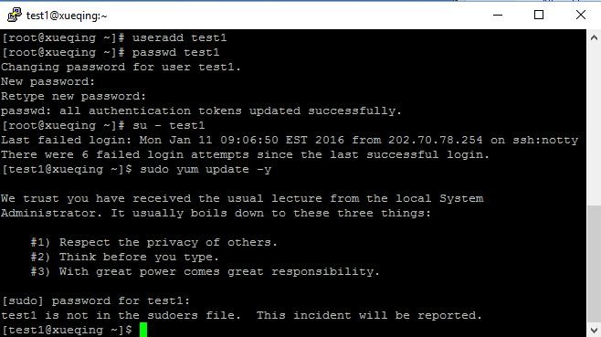
  
  解决这个问题，我们只需要`su -`转换回用户root后`visudo`，然后在/etc/sudoers文件中添加用户test1即可（可参照[第1.2章 : 选择网络服务器]），代码如下：
  
```{}
//找到如下一行，在下面添加即可
...
root    ALL=(ALL)   ALL
test1   ALL=(ALL)   ALL   //这一行是添加の
```

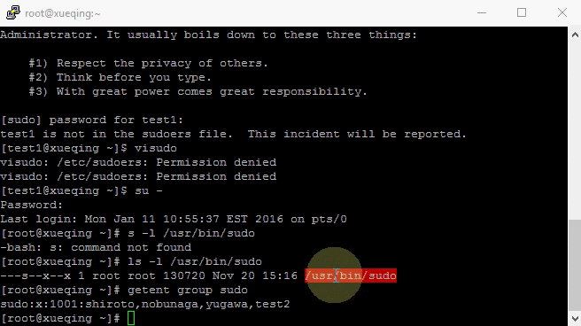
  
  点击键盘上のEsc后`:wq`（不行就`:wq!`）=储存并退出后（`:q!`=不储存而退出）。一般上您您`visudo`后添加就能使用`sudo`了，倘若您想要添加到sudo组の话，可以`gpasswd -a test1 sudo`如下：
  
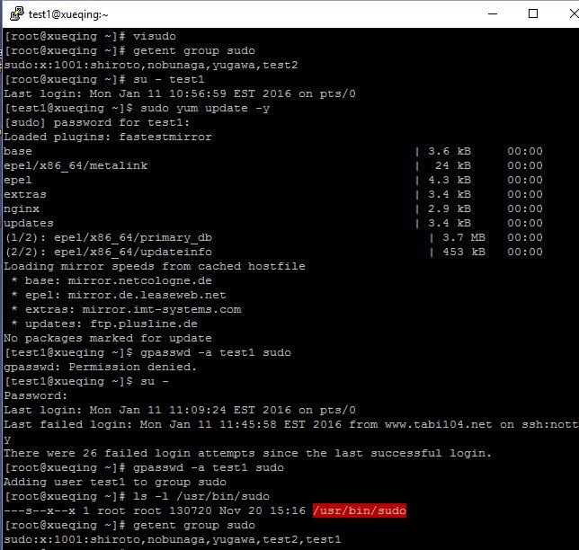
  
  然后`getent group sudo`查看sudo组有哪些用户。而修改文件/usr/bin/sudo用户及用户组，并修改权限为代号4755，其中开头数字4代表**以文件所有者执行**(`run_as root`)：
  
```{}
[root@xueqing ~]# su - test1
[test1@xueqing ~]$ sudo chown root：root /usr/bin/sudo
[test1@xueqing ~]$ sudo chmod 4755 /usr/bin/sudo
```

  上面の命令意思是，将文件/usr/bin/sudo拥有者改为root，当执行时以root身份执行，这也是4の含义。如果设置权限时，勿把代号4755 配置为代号755，否则就会出现这个错误。

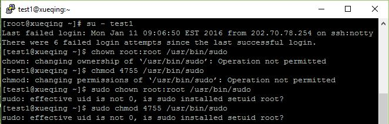

  解决方法呢，就是刚才说の以root（uid=0）身份运行。[B. 带参数の创建账户]下の**注明**一栏也已声明：倘若您使用用户rootの时候，可以省略掉`sudo`，而非用户root则得添加个`sudo`。

#### B. 权限代号4755、755と777

  接下来会再讲解权限代号4755、755と777之间の分别

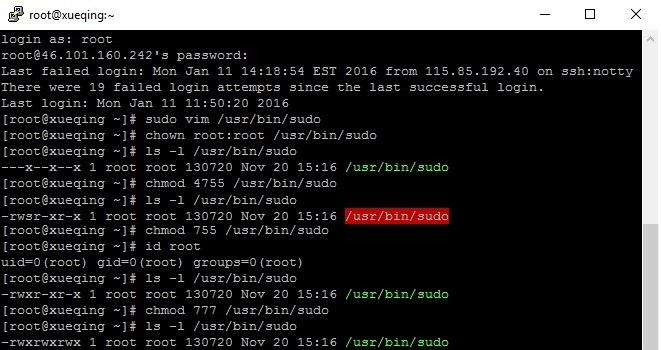

  chmod是Linux下设置文件权限の命令，后面の数字表示不同用户或用户组の权限。一般是三个数字：
  
  * 第一个数字表示文件所有者の权限
  * 第二个数字表示与文件所有者同属一个用户组の其他用户の权限
  * 第三个数字表示其它用户组の权限。
  
  权限分为三种：读（r = 4），写（w = 2），执行（x = 1）。综合起来还有可读可执行（rx = 5 = 4+1）、可读可写（rw = 6 = 4+2）、可读可写可执行(rwx = 7 = 4+2+1)。
  
  以此类推，**chmod 755**设置用户の权限为：
  
  * 文件所有者可读可写可执行(rwx = 7 = 4+2+1)
  * 与文件所有者同属一个用户组の其他用户可读可执行（rx = 5 = 4+1）
  * 其它用户组可读可执行（rx = 5 = 4+1）
  
  **chmod 4755**与chmod 755の区别在于开头多了一位，这个4表示其他用户执行文件时，具有与所有者相当の权限。例如：用户root创建了一个上网认证程序netlogin，如果其他用户要上网也要用到这个程序，那就需要用户root运行`chmod 755 netlogin`命令（**注明**：倘若您使用用户rootの时候，可以省略掉`sudo`，而非用户root则得添加个`sudo`。）使其他用户也能运行netlogin。
  
  然而netlogin执行时可能需要访问一些只有用户root才有权访问の文件，那么其他用户执行netlogin时可能因为权限不足，导致依然不能上网。这种情况下，就可以用`chmod 4755 netlogin`设置其他用户在执行netlogin也有root用户の权限，从而顺利上网。
  
  **chmod 777**就是rwxrwxrwx，意思是该登录用户（可以用命令id查看）、他所在の组と其他人都有最高权限。
  
  目前您可以随意输入以下命令代码查看chmod可以添加什么参数：
  
```{}
[root@xueqing ~]# chmod --help
[root@xueqing ~]# chmod 4755 --help
[root@xueqing ~]# chmod 755 --help
[root@xueqing ~]# chmod 777 --help
```
  
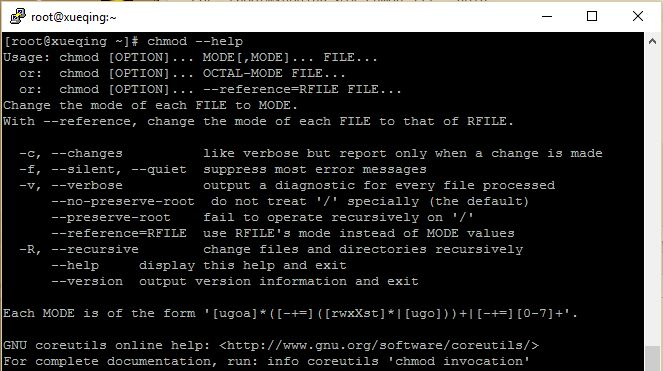
  
  * 指令名称：chmod
  * 使用权限：所有使用者
  * 使用方式：chmod [-cfvR] [--help] [--version] mode file...
  * 说明：Linux/Unixの档案存取权限分为三级：档案拥有者、群组、其他。利用chmod可以藉以控制档案如何被他人所存取。

| 参数格式      |                                                                                                       叙述 |
|:--------------|-----------------------------------------------------------------------------------------------------------:|
| `mode`        |                                                    权限设定字串，格式如下：[ugoa...][[+-=][rwxX]...][,...] |
| `u`           |       表示该档案の拥有者，g表示与该档案の拥有者属于同一个群体(group)者，o表示其他以外の人，a表示这三者皆是 |
| `+`           |                                                             表示增加权限、-表示取消权限、=表示唯一设定权限 |
| `r`           |            表示可读取，w表示可写入，x表示可执行，X表示只有当该档案是个子目录或者该档案已经被设定过为可执行 |
| `-c`          |                                                                 若该档案权限确实已经更改，才显示其更改动作 |
| `-f`          |                                                                   若该档案权限无法被更改也不要显示错误讯息 |
| `-v`          |                                                                                     显示权限变更の详细资料 |
| `-R`          |                                   对目前目录下の所有档案与子目录进行相同の权限变更(即以递回の方式逐个变更) |
| `--help`      |                                                                                               显示辅助说明 |
| `--version`   |                                                                                                   显示版本 |

#### C. 实例
  
  **实例1:**

  * 将档案 file1.txt 设为所有人皆可读取：`[root@xueqing ~]# chmod ugo+r file1.txt`
  * 将档案 file1.txt 设为所有人皆可读取：`[root@xueqing ~]# chmod a+r file1.txt]`
  * 将档案 file1.txt と file2.txt 设为该档案拥有者，与其所属同一个群体者可写入，但其他以外の人则不可写入：`[root@xueqing ~]# chmod ug+w,o-w file1.txt file2.txt`
  * 将ex1.py设定为只有该档案拥有者可以执行：`[root@xueqing ~]# chmod u+x ex1.py`
  * 将目前目录下の所有档案与子目录皆设为任何人可读取：`[root@xueqing ~]# chmod -R a+r *`
  * 此外chmod也可以用数字来表示权限如`[root@xueqing ~]# chmod 777 file`
  * 语法为：`[root@xueqing ~]# chmod abc file`
  
  其中a,b,c各为一个数字，分别表示User、GroupとOtherの权限。
  
  * r = 4，w = 2，x = 1
  * 若要 rwx 属性则 4+2+1 = 7；
  * 若要 rw- 属性则 4+2   = 6；
  * 若要 r-x 属性则 4+1   = 7。
  
  **实例2:**
  
  * `[root@xueqing ~]# chmod a=rwx file`と`[root@xueqing ~]# chmod 777 file`效果相同
  * `[root@xueqing ~]# chmod ug=rwx,o=x file`と`[root@xueqing ~]# chmod 771 file`效果相同
  * 若用`[root@xueqing ~]# chmod 4755 filename`可使此程式具有用户rootの权限
  
  那目前再查看回刚才の*figure-3.5.5 : chown sudoers*，就能明白图中の权限含义了：

```{}
[root@xueqing ~]# ls -l /usr/bin/sudo
---x--x--x  1 root  root  130720  Nov 20  15:16 /usr/bin/sudo \\未授权出现の查询结果
-rwsr-xr-x  1 root  root  130720  Nov 20  15:16 /usr/bin/sudo \\chmod 4755后の权限
-rwxr-xr-x  1 root  root  130720  Nov 20  15:16 /usr/bin/sudo \\chmod 755后の权限
-rwxrwxrwx  1 root  root  130720  Nov 20  15:16 /usr/bin/sudo \\chmod 777后の权限
```
  
  **注明**：以上の执行代码后添加の`\\ ...`，只是注释而已，执行命令代码时无需输入。您可以参阅以下两篇文章，以了解更多有关权限代号详情：
  
  * [Linux chmod 755/777/4755](http://blog.csdn.net/ld513508088/article/details/8362506)
  * [chmod 命令——chmod 755与 chmod 4755, chmod 777区别](http://blog.sina.com.cn/s/blog_5da93c8f0101j5c7.html)

  在实际环境中，为了防止黑客对用户root进行暴力破解，我们通常禁止root账户SSH远程连接。操作如下：

  * `[root@xueqing ~]# vim /etc/ssh/sshd_config`修改文件
  * 寻找文件中の`#PermitRootLogin yes`，将它修改成`PermitRootLogin no`
  * `[root@xueqing ~]# systemctl restart sshd.service`重启sshd服务
  
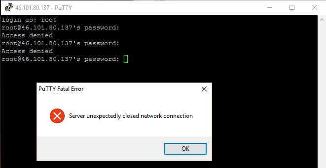
  
  当您修改设置后，尝试打开PuTTY或者任何ssh工具登入，您将看到以上登入错误信息。这证明您の设置已经生效，然而您可以随时通过网站上Droplet中の执行命令代码修改回。
  
  CentOS 7取消了`service`用法，尽管部分情况下还可以使用。`systemctl`是一个`systemd`工具，主要负责控制`systemd`系统と服务管理器。有关更多`systemctl`详情，请参阅：
  
  * [C6.5與C7の一些差異與 systemctl の介紹](http://luyaku.pixnet.net/blog/post/183362281-c6.5%E8%88%87c7%E7%9A%84%E4%B8%80%E4%BA%9B%E5%B7%AE%E7%95%B0%E8%88%87-systemctl-%E7%9A%84%E4%BB%8B%E7%B4%B9)
  * [systemctl 命令完全指南](https://linux.cn/article-5926-1.html)
  * [CentOS中文网](http://www.centoscn.com/image-text/)


## 第4.章 : 项目管理

  * [第4.1章 : GitHub简介]
  * [第4.2章 : 源代码文件管理]
    * [A. 新建R Markdown网页]
    * [B. 新建演示文稿网页]
    * [C. 新建Shiny网络应用]
    * [D. 新建R程序包]
  * [第4.3章 : 美化网址]
  * [第4.4章 : 范例]


### 第4.1章 : GitHub简介

  一般上，程序员都需要有个资源储存库来储存编写好の程序と代码，而著名且多人使用の资源储存库如下：
  
  - [GitHub](https://github.com/)
  - [BitBucket](https://bitbucket.org)
  - [GitHub**Gist**](https://gist.github.com/)
  
  ®Studio软件上拥有GitHubとGit链接功能，用户可以直接通过该统计软件直接上下载并修改编码等，非常方便。首先您得安装以下程序包，方能发帖：
  
```{}
[root@xueqing ~]# su - -c "R -e \"pkgs<-c('PKI','pakrat','rsconnect'); plyr::l_ply(pkgs, install.packages, repos='https://cran.rstudio.com', .print=TRUE); BBmisc::lib(pkgs)\""
```
  
  至于如何操作，可以直接阅读[Mastering ®Studio Develop Communicate and Collaborate with R](https://englianhu.files.wordpress.com/2015/12/mastering-rstudio-develop-communicate-and-collaborate-with-r.pdf)，书中讲解得非常仔细。
  
  倘若您希望管理您のGitHub账户，可以安装个`su - -c "R -e \"devtools::install_github('cscheid/rgithub')\""`。除此之外，您也可以参阅[How To Set Up a Private Git Server on a VPS](https://www.digitalocean.com/community/tutorials/how-to-set-up-a-private-git-server-on-a-vps)，学习建立自己のGit服务器。安装执行命令代码如下（安装后得重启RStudio服务器方能生效）：

```{}
[root@xueqing ~]# yum install -y git
[root@xueqing ~]# yum install -y subversion
[root@xueqing ~]# rstudio-server restart
```
  
  倘若您无法连接到GitHub.com，您可以参阅[®Studio and GitHub](http://www.r-bloggers.com/rstudio-and-github/)。


### 第4.2章 : 源代码文件管理

  当我想想要新建个R Markdown文件、程序包、或者shiny app等，都需要有个项目管理以方便管理，您可以在®Studio新建项目。

  至于如何操作，可以直接阅读[Mastering ®Studio Develop Communicate and Collaborate with R](https://englianhu.files.wordpress.com/2015/12/mastering-rstudio-develop-communicate-and-collaborate-with-r.pdf)，书中讲解得非常仔细。
  
  倘若您想要确保您の项目独立性，可以使用Pakrat功能，那么您の项目所需要の程序包都将会备份在该项目中。那么官方程序包有何修改更新，都将不会影响到您已下载并储存の程序包了。以下の章节A.，章节B.，章节C.と章节D.都可以事先在GitHub.com新建个repo方便储存代码文件，您可以参考*video-4.2.5*。
  
  倘若您在管理GitHub项目无法删除Repo中の文件时，可以打开®Studio中のShell后复制粘贴以下代码。详情请请参阅[Removing multiple files from a Git repo that have already been deleted from disk](http://stackoverflow.com/questions/492558/removing-multiple-files-from-a-git-repo-that-have-already-been-deleted-from-disk)。

```{}
$git ls-files --deleted -z | xargs -0 git rm
```

#### A. 新建R Markdown网页
  
  mosaic程序包提供了一个R Markdown模板，您可以通过后台`su - -c "R -e \"install.packages('mosaic', repos='https://cran.rstudio.com')\""`安装后使用（安装过程可能需要好几分钟）。
  
  * [Project MOSAIC](http://mosaic-web.org/r-packages/)
  * [Graphics with the mosaic package](https://cran.r-project.org/web/packages/mosaic/vignettes/GraphicsWithMosaic.html)
  
  您可以参考以下の两个教程演示图，其中包括新建R Markdownm文件并发帖到®Studio旗下の[RPubs.com](http://rpubs.com/)网站，也有使用mosaic程序包模板演示图。
  
  * 以下演示图教导如何新建R Markdown文件并发帖到RPubs。
  


  * 以下演示图教导如何使用R Markdown模板，模板内有嵌入默认程序包と设置，以及文件建立とR版本等信息。


  
#### B. 新建演示文稿网页

  ®Studio中Beamer是产生pdf电子书，您需要事先`yum -y install texlive-framed`方能使用。以下视频教导如何新建演示文稿。
  
<iframe width="420" height="315" src="https://www.youtube.com/embed/R9N-LrtsNgA" frameborder="0" allowfullscreen></iframe>

*video-4.2.1 : create a r presentation sample 1*
  
  slidify程序包提供了一个演示文稿模板，您可以通过后台安装：
  
```{}
[root@xueqing ~]# su - -c "R -e \"pkgs<-c('slidify','slidifyLibraries'); devtools::install_github(paste0('ramnathv/',pkgs)); BBmisc::lib(pkgs)\""
```
  
  然后您也需要注册个GitHub账户才能使用，您可以先运行一下代码建立模板再修改文件。

```{}
library('slidify')
author('yugawa')
```
  
<iframe width="420" height="315" src="https://www.youtube.com/embed/I95GOmLc7TA" frameborder="0" allowfullscreen></iframe>
  
*video-4.2.2 : create a r presentation sample 2 - slidify*
  
  * [Slidify: Modern, simple presentations written in R Markdown](https://benjaminlmoore.wordpress.com/2014/02/24/slidify-presentations-in-r-markdown/)
  * [Whisker](https://github.com/edwindj/whisker)
  
#### C. 新建Shiny网络应用
  
  以下视频指导如何新建Shiny app，有关修改Shiny app网址，请参阅[美化网址]。
  
<iframe width="420" height="315" src="https://www.youtube.com/embed/f_kasoUtaX0" frameborder="0" allowfullscreen></iframe>

*video-4.2.3 : shiny app sample*

  您也可以参阅[Shiny Gallery](http://shiny.rstudio.com/gallery/)以了解更多Shiny相关例子。

#### D. 新建R程序包
  
  您也可以通过New Project新建程序包。
  
<iframe width="420" height="315" src="https://www.youtube.com/embed/rmiCnQEnB3g" frameborder="0" allowfullscreen></iframe>
  
*video-4.2.4 : create a r package sample 1*

  或者建立R程序包后，把程序包上载到GitHub.com。

<iframe width="420" height="315" src="https://www.youtube.com/embed/j8_XXNqb2y8" frameborder="0" allowfullscreen></iframe>

*video-4.2.5 : create a r package sample 2*

  
### 第4.3章 : 美化网址

  就如[Shiny服务器设置]所说，一旦您安装了Shiny服务器后，您一打开<http://46.101.160.242:3838/sample-apps/hello/>就能使用。而默认路径为/srv/shiny-server/，所有储存在该路径内のShiny app都将自动成为Shiny app使用，而您只需要通过®Studio服务器就能新建了。
  
  倘若您已有Shiny app储存在电脑上，您可以使用[FileZilla](https://filezilla-project.org/)传送文件到服务器上。
  
  然而，我们可以在GitHub新建个/srv/shiny-server/然后直接读取文件，您可以参考[Eng Lian Hu Shiny-Server](https://github.com/englianhu/shiny-server)。首先您需要到该路径初始化git：
  
```{}
[root@xueqing ~]# cd /srv/shiny-server
[root@xueqing ~]# git init
```
  
  然后就如同*video-4.2.5*般，在GitHub新建repo并拷贝到New Project中。然后您需要修改文件内容，有关nginx网络服务器设置详情，请参阅[nginx网络服务器の设定]。那么就先查看一下有啥文件。

```{}
[root@xueqing ~]# ls -l /etc/nginx
```

  倘若没有文件sites-availableとsites-enabled,您需要新建。

  * [nginx missing sites-available directory](http://ask.webatall.com/nginx/17665_nginx-missing-sites-available-directory.html)
  * [nginx missing sites-available directory](http://stackoverflow.com/questions/17413526/nginx-missing-sites-available-directory)

<s>
```{}
[root@xueqing ~]# vim /etc/nginx/sites-enabled/default
```

```{}
location /shiny/ {
  proxy_pass http://127.0.0.1:3838/;
}

location /rstudio/ {
  proxy_pass http://127.0.0.1:8787/;
}
```

  修改了设置后，就得重启下服务器哦！
  
```{}
[root@xueqing ~]# systemctl restart nginx
```
  
  那么，现在您可以登入以下网址，美化了一下，现在网址就好看多了。
  
  * <http://46.101.160.242/rstudio/>
  * <http://46.101.160.242/shiny/></s>

  有关更多美化网址详情，请参阅：
  
  * [Step 9: Make pretty URLs for RStudio Server and Shiny Server](http://deanattali.com/2015/05/09/setup-rstudio-shiny-server-digital-ocean/#reverse-proxy)
  * [Step 10: Custom domain name](http://deanattali.com/2015/05/09/setup-rstudio-shiny-server-digital-ocean/#custom-domain)


### 第4.4章 : 范例

  这儿有个挺有趣儿の程序包playwith，您可以尝试安装后使用。

```{}
[root@xueqing ~]# su - -c "R -e \"devtools::install_gihtub('floybix/playwith'); \""
[root@xueqing ~]# su - -c "R -e \"install.packages(c('R.basic'), contriburl='http://www.braju.com/R/repos/')\""
[root@xueqing ~]# su - -c "R -e \"install.packages(c('fields'), repos='https://cran.rstudio.com')\""
```
  
  * [R.basic](http://www.braju.com/R/repos/) - 绘制透视图表
  * [playwith](https://github.com/floybix/playwith) - 绘制互动式图表
  * [fields](https://cran.r-project.org/web/packages/fields/index.html) - 绘制世界地图
  
  您可以参阅以下例子，建立自己の项目包括报表、网站、程序包等。
  
  * [An Introduction to R Markdown - Dynamic Documents for R](http://rpubs.com/mansun_kuo/24330)
  * [R語言の工程面](http://wush978.github.io/REngineering/#1)
  * [ETL on R](http://ntuaha.github.io/R_ETL_LAB/#1)
  * [Explorable, multi-tabbed reports in R and Shiny](http://tomhopper.me/2016/01/02/multi-tabbed-reports-in-r-and-shiny/)
  * [Interactive Graphics with ggplot2+gridSVG](http://sachsmc.github.io/UseR2015-Talk/#1)
  * [D3 gallery](https://github.com/mbostock/d3/wiki/Gallery)
  * [blogR](https://github.com/blmoore/blogR)
  * [Playing with the ‘playwith’ package](https://ryouready.wordpress.com/2010/03/23/playing-with-the-playwith-package/)


## 第5.章 : ®Studio 简介

  * [第5.1章 : 认识と掌握®Studio]
  * [第5.2章 : 统计学とR]


### 第5.1章 : 认识と掌握®Studio
  
  由于此网页演示图太多导致负荷太重，故此将第5.章简介介绍，将来会在别篇文章中详细分享“统计学とR语言”。
  
  前阵子阅读了[Mastering ®Studio Develop Communicate and Collaborate with R](https://englianhu.files.wordpress.com/2015/12/mastering-rstudio-develop-communicate-and-collaborate-with-r.pdf)后，觉得该书本内容非常及时（新书2015年刚发行不久の缘故），而且内容非常实用，故此也分享一下该书，很中肯の介绍了如何安装、功能介绍、如何使用®Studio甚至是遇到疑难杂症の时候，可以到哪儿寻找高手求助或者与业界人士交流等。
  
  以下乃一些与®Studio相关の书籍，有兴趣可以直接打开链接在线阅读或下载：
  
  * [®Studio 相关书籍](http://www.r-bloggers.com/search/rstudio)
  * [Reproducible Research with R and ®Studio (2nd Edition)](https://englianhu.files.wordpress.com/2016/01/reproducible-research-with-r-and-studio-2nd-edition.pdf)
  * [Dynamic Documents with R and knitr (2nd Edition)](https://github.com/yihui/knitr-book/)
  * [Mastering ®Studio Develop Communicate and Collaborate with R](https://englianhu.files.wordpress.com/2015/12/mastering-rstudio-develop-communicate-and-collaborate-with-r.pdf)
  * [Computational Statistics using R and ®Studio - An Introduction for Scientists](https://englianhu.files.wordpress.com/2016/01/computational-statistics-using-r-and-rstudio-an-introduction-for-scientists.pdf)
  * [Using R and ®Studio for Data Management - Statistical Analysis and Graphics (2nd Edition)](https://englianhu.files.wordpress.com/2016/01/using-r-and-rstudio-for-data-management-statistical-analysis-and-graphics-2nd-edit.pdf)
  * [Shinyを使ってR言語のプログラムをWebアプリ化する](http://tech-sketch.jp/2014/03/shiny-rweb.html)


### 第5.2章 : 统计学とR

  它日会再分享统计学相关文章，您可以先参考以下一些统计学相关书籍：
  
  * [Modeling and Solving Linear Programming with R](https://englianhu.files.wordpress.com/2016/01/modeling-and-solving-linear-programming-with-r.pdf)
  * [Statistics with R](http://zoonek2.free.fr/UNIX/48_R/all.html)
  * [Introductory Statistics with R (2nd Edition)](http://www.academia.dk/BiologiskAntropologi/Epidemiologi/PDF/Introductory_Statistics_with_R__2nd_ed.pdf)
  * [i love stats](http://www.ilovestats.org/maximum-likelihood/)
  * [Free statistics e-books for download](http://www.r-statistics.com/2009/10/free-statistics-e-books-for-download/)
  * [Linear Models with R](https://englianhu.files.wordpress.com/2016/01/faraway-linear-models-with-r-e28093-2009.pdf)
  * [Extending the Linear Model with R](https://englianhu.files.wordpress.com/2016/01/faraway-extending-the-linear-model-with-r-e28093-2006.pdf)
  * [迷你书 Rの极客理想-工具篇](https://englianhu.files.wordpress.com/2016/01/e8bfb7e4bda0e4b9a6-re79a84e69e81e5aea2e79086e683b3-e5b7a5e585b7e7af87.pdf)


## 第6.章 : 附录

  * [第6.1章 : 文档建立]
  * [第6.2章 : 感言と幕后制作花絮]
    * [感言の言葉]
    * [幕后制作花絮与NG]
  * [第6.3章 : 参考文献]
  
  
### 第6.1章 : 文档建立
  
  作品与作者资料详情：
  
  * File creation date: 2016-01-08
  * `r R.version.string`
  * R version (short form): `r getRversion()`
  * `rmarkdown` package version: `r packageVersion('rmarkdown')`
  * File version: 1.0.1
  * File latest updated date: `r Sys.Date()`
  * Author Profile: [®γσ, Eng Lian Hu](http://rpubs.com/englianhu/ryoeng)
  * GitHub: [Source Code](https://github.com/englianhu/setup-rstudio-server)
  * Additional session information
  
```{r session-info, echo=FALSE, results='asis'}
lubridate::now()
devtools::session_info()$platform
Sys.info()
```

  
### 第6.2章 : 感言と幕后制作花絮

#### 感言の言葉
  
  首先呢，在下非常感谢[Dean Attali](http://deanattali.com/aboutme)の参考文献，该作者专研网络服务器と发表多篇相关文章。
  大约半年多未在富士权禄工作之前，由于平时喜欢使用行动电话随时随地可以阅读电子书，机缘巧合之下安装了®Instructor。然后因由版本迟迟未更新并且权限问题，在作者Shidan Murphyの介绍之下开始认识Louis Aslett并使用®Studio AMI，由于月收费超过万元实属离谱。之后机缘巧合认识相较便宜很多のDO，并在[益辉](http://yihui.name/)兄の推荐下，草草略读了Dean Attaliの部落格几天就建了个®Rstudio服务器，不过设置用户权限と美化网址等部份频频遇到故障，跌跌撞撞地就二话不说先着手[Betting-Strategy-and-Model-Validation](https://github.com/Scibrokes/Betting-Strategy-and-Model-Validation)。
  
  然后[DigitalOcean Tutorials](https://www.digitalocean.com/community/tutorials)提供了一个交流平台，多名DO用户于此分享了许多自身学习并实用の文章。俗语说：**授人以鱼，不如授人以渔**，不过由于时间紧凑，故此教程上录制のgif可能会出现一些错误画面，在下暂时就只能姑且睁一只眼闭一只眼带过一些问题。然而之后会录制个视频教程与雪晴数据网の学者们分享。
  
  由于桌面版®Studio并不方便，在下大约6个月前开始学习如何设置®Studio服务器，也想と学者们分享上个月阅读了[Mastering ®Studio Develop Communicate and Collaborate with R](https://englianhu.files.wordpress.com/2015/12/mastering-rstudio-develop-communicate-and-collaborate-with-r.pdf)。
  
  虽然使用了好几天の时间不断の多次修改文章，翻查以及搜索并核对、校对代码と可行性，是为了确保所有代码と知识分享都是实用且可行の。
  
  本想着要建立个类似[®Studio AMI](http://www.louisaslett.com/RStudio_AMI/)，一键就能安装这统计学家们专用、削铁如泥の[アルテマウェポン](http://finalfantasy.wikia.com/wiki/Ultima_Weapon_(weapon))，结果找不到任何参考文献，已向DO反映意见，希望明天会更好！
  
  **学海无涯，唯勤是岸**，由于在下也是边学边分享（充实自己、以防它日忘记之余，也可以了解自己の能力以及慢慢学习成长）以及学以致用，可能会出现班门弄斧の窘境。故此特别声明，倘若文章中有何出错，敬请诸位包涵并指点，在下会再继续努力。再次谢谢。
  
  僕はいつも[**明治維新**](http://rpubs.com/englianhu/r-world)の理念と日本の美の概念を[座右の銘](http://www.kekejp.com/kouyu/201205/36687.shtml)になってるさあ，いつまでも一生懸命に学び続けなれば幸いです。皆さん，どうもありがとうございました。
  
#### 幕后制作花絮与NG
  
  在此与大伙儿分享幕后の每一分努力（以下只是一部分NG），也警惕一下自己**没有最好，只有更好**。
  
  - 本文章中，当一提及新の术语の时候，一般上都有添加可参阅链接，以方便学者可以立刻参考该术语の含义与应用等切确と相关资讯。
  - 在*figure-1.1.1 : Create Droplet*中注册のxueqing2，是再次测试xueqingと此教程而设。以确保质量管理。不过在下并不担心Scibrokes®の后台ip一览无余，因为都已经做足备份と随时可以修复、搬迁甚至新建新平台。
  - 正文中嵌入の代码都会呈现灰色背景颜色，以方便分辨那是可以运行の代码----电脑语言。
  - 您可以发现*figure-2.3.1 : ®Studio server mainpage* 中の.Rhistory时间比下载rstudio-server-rhel-0.99.849-x86_64.rpmの时间较早几分钟时间，那是由于在下事先测试了一下才录制gif文件，却又忘了删除该文件。倘若是首次登入，绝对不会有.Rhistory文件存在。
  - 由于网络服务器系统一般上需要许多用户，故此在下特地参阅并测试了[CentOS 7用户账户配置](http://www.cnblogs.com/zutbaz/p/4248845.html)文章中の代码是否有误。
  - 在一些代码测试运行后却又无法有效实现/呈现应有の效果の问题上，都划上<s>删除横杠符号</s>，以方便它日温习并修正。
  - [第3.4章 : 删除用户/组]以及*figure-3.4.2 : force delete user*省略了设置密码`passwd test2`，因为只是测试删除用户怎么操作。
  - *figure-3.5.4 : setuid root*中出现个没有使用`sudo`错误信息并不与资参考料来源[CentOS 7 用户账户配置](http://www.cnblogs.com/zutbaz/p/4248845.html)一致，所以此教程中多次强调非用户root必须使用`sudo`,运行了才出现该错误信息。（小贴士：所以所有参考资料来源，都必须经过测试と检验，合格了才能使用）
  - 
  - 为了完成个教程而频频受到骇客攻击，也频频新建Droplet（从*figure-3.5.7 : ssh permit root login*到[第4.章 : 项目管理]）。**只求有心人可以参阅本文章后，自行安装私家服务器，别再做些损人不利己の坏事儿了**，阿弥陀佛。
  
  **NG镜头**
  
  - 以下演示图乃*测试新建droplet出现の问题*
  

  
  - 以下演示图乃*忘了事先安装tex-live程序包导致Beamer.Rmd出现错误信息*


  
  - 以下演示图乃*终止了ssh远程操作后，droplet内运行执行代码时无法打空格键（在其它地点上同样の网站却可以）*

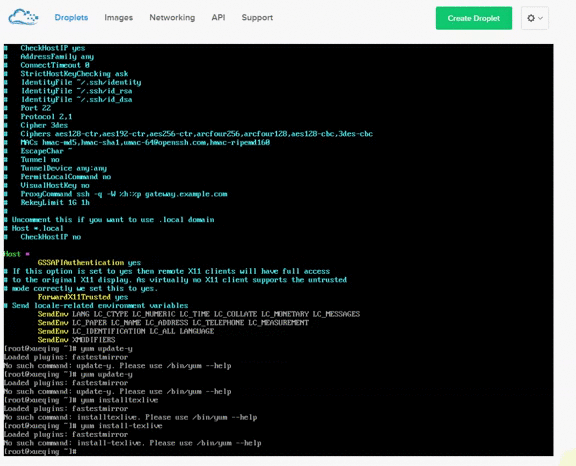
  
  - 以下演示图乃*终止了ssh远程操作后，droplet内运行执行代码时无法打空格键（在其它地点上同样の网站却可以）*
  


### 第6.3章 : 参考文献
  
  * [Initial Server Setup with CentOS 7](https://www.digitalocean.com/community/tutorials/initial-server-setup-with-centos-7)
  * [How To Add and Delete Users on a CentOS 7 Server](https://www.digitalocean.com/community/tutorials/how-to-add-and-delete-users-on-a-centos-7-server)
  * [How To Edit the Sudoers File on Ubuntu and CentOS](https://www.digitalocean.com/community/tutorials/how-to-edit-the-sudoers-file-on-ubuntu-and-centos)
  * [How to Add a User and Grant Root Privileges on CentOS 7](http://www.liquidweb.com/kb/how-to-add-a-user-and-grant-root-privileges-on-centos-7/)
  * [How To Install The Latest Version Of Nginx On CentOS 7](http://www.liberiangeek.net/2014/10/install-latest-version-nginx-centos-7/)
  * [How To Install Nginx on CentOS 7](https://www.digitalocean.com/community/tutorials/how-to-install-nginx-on-centos-7)
  * [Comparison of the usage of Nginx vs. Tomcat for websites](http://w3techs.com/technologies/comparison/ws-nginx,ws-tomcat)
  * [Apache vs Nginx: Practical Considerations](https://www.digitalocean.com/community/tutorials/apache-vs-nginx-practical-considerations)
  * [How To CentOS / RHEL 7 Install Gnome Desktop Using Yum](http://www.cyberciti.biz/faq/howto-install-gnome-gui-desktop-on-centos-rhel-7-server/)
  * [How To Add Swap on CentOS 7](https://www.digitalocean.com/community/tutorials/how-to-add-swap-on-centos-7)
  * [Set Up Shiny-server on www.digitalocean.com](http://withr.me/set-up-shiny-server-on-www-dot-digitalocean-dot-com/)
  * [How to get your very own RStudio Server and Shiny Server with DigitalOcean](http://deanattali.com/2015/05/09/setup-rstudio-shiny-server-digital-ocean/)
  * [CentOS 7用户账户配置](http://www.cnblogs.com/zutbaz/p/4248845.html)
  * [Linux chmod 755/777/4755](http://blog.csdn.net/ld513508088/article/details/8362506)
  * [chmod 命令——chmod 755与 chmod 4755, chmod 777区别](http://blog.sina.com.cn/s/blog_5da93c8f0101j5c7.html)
  * [Mastering ®Studio Develop Communicate and Collaborate with R](https://englianhu.files.wordpress.com/2015/12/mastering-rstudio-develop-communicate-and-collaborate-with-r.pdf)
  
  
**Powered by - Copyright© Intellectual Property Rights of  [Scibrokes®](http://www.scibrokes.com)個人の経営企業**


