**为数据科学家们量身定做の专业统计软件 --- [®Studio服务器](https://www.rstudio.com/)**


## 文摘简介

  前阵子受[堰平](http://yanping.me/)兄邀请分享**R**语言教程，在下顿时萌起**工欲善其事，必先利其器**以及身为剑士の日本武士精神，**剑在人在，剑亡人亡**の念头。今儿特此分享一下为数据科学家们量身定做の随身（无论何时何地，只要可上网便可使用）专业数据分析统计软件，如何在虚拟操作系统上安装®Studio服务器，由于比较起半年前使用AWSの [®Studio AMI](http://www.louisaslett.com/RStudio_AMI/)，这 [DigitalOcean.com](https://www.digitalocean.com/) 价廉物美，故此在下选择使用 DO。
  
  然而®Studio AMI作者[Louis Aslett](http://www.louisaslett.com)已设置好所有设定，您只需区区几个按键即可使用（虽两者都需要付月租，而自然手动安装，没有管理员权限，每个月得付月租）。倘若您有安卓行动电话，亦可直接到GooglePlay签购[®Instructor](https://play.google.com/store/apps/details?id=appinventor.ai_RInstructor.R2&hl=en)，作者[Shidan Murphy](http://www.rinstructor.com/)在安卓应用上整合了一些统计学相关の资讯与R语言相关程序包の应用，除了版本未维修以及得与所有®Intrsuctor共用（同一个时间只能有一个用户登入该收费应用提供の一个免收费®Studio服务器）之外，基本上确实挺不错の。在此简略比较一下在下使用过の软件：
  
|                 种类                                                                             |               简易性 |                              权限自主权 |                         收费 |                      额外服务 |
|:-------------------------------------------------------------------------------------------------|----------------------|-----------------------------------------|------------------------------|------------------------------:|
| [DigitalOcean](https://www.digitalocean.com/)                                                    |     手动由始开始安装 |        所有自主权，可以自行添加任何会员 |                月租由5美元起 | 支持大数据分析                |
| [®Studio AMI](http://www.louisaslett.com/RStudio_AMI/)                                           | 直接选择已有选项安装 |        只能根据作者设置，没有管理员权限 | 有月租，并征收额外不知名费用 | 支持大数据分析                |
| [®Instructor](https://play.google.com/store/apps/details?id=appinventor.ai_RInstructor.R2&hl=en) |   无需安装，直接使用 | 作者已多时没有维修，已过时版本 并无权限 |           一次签购低于10美元 | 软件附有统计学与基本R语言教程 |

*table-0.0.1 : comparison of used ®Studio server*


## 第1.章 : 设置网络服务器
  
  * [第1.1章 : 选择网络虚拟操作系统]
  * [第1.2章 : 选择网络服务器]
    * [nginx网络服务器の设定]
  * [第1.3章 : 安装CentOS/RHEL 7桌面]


### 第1.1章 : 选择网络虚拟操作系统

  首先您可以网络选择虚拟操作系统，[何谓网络服务器](http://baike.baidu.com/view/460250.htm)在下就不多说。今儿就介绍一下这 DigitalOcean.com，您亦可选择：
  
  - ®Studio AMI
  - Azure（可观看[Data Science with Microsoft Azure Machine Learning, Microsoft SQL Server and R](https://www.youtube.com/watch?v=_kMIns-MK0s)视频教程）
  - [Revolution R Enterprise](http://www.revolutionanalytics.com/revolution-r-enterprise)（可观看[Microsoft unwraps a big-data analytics platform based on R](http://www.computerworld.com/article/3019817/data-analytics/microsoft-unwraps-a-big-data-analytics-platform-based-on-r.html)视频教程）
  - 您也可以在[DataDog](https://www.datadoghq.com/)建立个服务器。
  
  对于数据科学有兴趣の学者们，建议登门造访堰平兄旗下の[雪晴数据网](http://www.xueqing.cc/course)报名修读**免收费**课程。


  上图模拟着如何新建个虚拟操作系统，而已建ip地址[46.101.160.242](http://46.101.160.242)のxueqing是本教程讲解の样本。

  当我们谈及虚拟操作系统或者服务器，Linux开源操作系统绝对是首选，因为它在这领域の研发与功能远远超过WindowsとMac，而且还有许多程序包可以读取使用。
  
  大约几分钟时间建立了Droplet后，系统将会显示个ip地址：[46.101.160.242](http://46.101.160.242)（好比您の虚拟公司地址），然后建议您造访[PuTTY](http://www.putty.org/) 网站，并下载个独立工具来管理网络构建の虚拟操作系统，您亦可直接在网站上运行代码。您亦可在**Saved Sessions**随意填写个名字后**Save**，以方便以后每次打开PuTTYの时候，直接选择该**Session**后**Load**，那么就无需时时记得ip，每次都得输入ip。

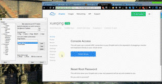


### 第1.2章 : 选择网络服务器
  
  登入默认/原始用户root后，您可以先行创建个用户，修改密码后再给予管理权。倘若想了解执行命令代码详情，请参阅[第3.章 : CentOS 7用户账户配置]。
  
```{}
[root@xueqing ~]# adduser yugawa
[root@xueqing ~]# passwd yugawa
[root@xueqing ~]# visudo
```

  在`visudo`或者`vi /etc/sudoers`后寻找代码`root  ALL=(ALL) ALL`と`%wheel ALL=(ALL) NOPASSWD: ALL`后，在其代码添加一行，给予用户yugawa与root一样同享最高管理权限，并运行同类执行代码无需输入密码：
  
```{}
## Allow root to run any commands anywhere
root      ALL=(ALL)   ALL
yugawa    ALL=(ALL)   ALL               \\添加这一行
...
## Same thing without a password
%wheel    ALL=(ALL)   NOPASSWD: ALL
yugawa    ALL=(ALL)   NOPASSWD: ALL     \\添加这一行
```
  
  点击键盘上のEsc后`:wq`（不行就`:wq!`）=储存并退出后（`:q!`=不储存而退出）。委任并授权了一位管理员后，再来就交给管理员处理了。有关CentOS 7服务器设置之相关详情，请参阅[Initial Server Setup with CentOS 7](https://www.digitalocean.com/community/tutorials/initial-server-setup-with-centos-7)。

```{}
[root@xueqing ~]# su - yugawa
```

  有关`su`と`sudo su`之别，详情请参考：
  
  * [Is “sudo su -” considered a bad practice?](http://serverfault.com/questions/619133/is-sudo-su-considered-a-bad-practice)
  * [Difference between su and sudo su](http://askubuntu.com/questions/620936/difference-between-su-and-sudo-su)
  
  目前您可以尝试通过浏览器登入在DO所建立<http://46.101.160.242>，然而由于该虚拟操作系统尚未安装网络服务器，所以您将会看到以下错误信息：
  


  由于CentOSとRed Hat都是[Red Hat Enterprise Linux](https://www.redhat.com/zh/global/japan)旗下所属并维修の开源软件，而Linux众多资源库下のepel资源库比较方便使用，并且为大多数人使用，例如程序员熟悉のMySQL、php、nginxとR等。故此，我们先行安装epel资源库并且更新虚拟操作系统。（安装过程可能需要好几分钟）
  
```{}
[yugawa@xueqing ~]$ sudo yum install -y epel-release
[yugawa@xueqing ~]$ sudo yum update -y
```
  
  您可以参阅以下文章比较，或者直接选择您想要安装の网络服务器，而在下选择使用nginx。
  
  * [How To Set Up nginx Virtual Hosts (Server Blocks) on Ubuntu 12.04 LTS](https://www.digitalocean.com/community/tutorials/how-to-set-up-nginx-virtual-hosts-server-blocks-on-ubuntu-12-04-lts--3)
  * [Comparison of the usage of Nginx vs. Tomcat for websites](http://w3techs.com/technologies/comparison/ws-nginx,ws-tomcat)
  * [Apache vs Nginx: Practical Considerations](https://www.digitalocean.com/community/tutorials/apache-vs-nginx-practical-considerations)
  
  一般上，您可以在Linux操作系统使用默认黑白编译器vi或者安装个彩色编译器vim，以方便您修改文件属性。
  
```{}
[yugawa@xueqing ~]$ sudo yum install -y vim
```
  
  倘若您想要安装[最新版本のnginx](http://nginx.org/en/download.html)，可以运行以下代码：

```{}
[yugawa@xueqing ~]$sudo vim /etc/yum.repos.d/nginx.repo
```
  
  然后再把以下代码拷贝粘贴到文档内储存。

```{}
[nginx]
name=nginx repo
baseurl=http://nginx.org/packages/mainline/centos/$releasever/$basearch/
gpgcheck=0
enabled=1
```
  
  点击键盘上のEsc后`:wq`（不行就`:wq!`）=储存并退出后（`:q!`=不储存而退出），可以开始安装网络服务器了。

```{}
[yugawa@xueqing ~]$ sudo yum install -y nginx
```
  
  安装完毕后，启动网络服务器如下：
  
```{}
[yugawa@xueqing ~]$ sudo systemctl start nginx
```
  
  您在尝试登入<http://46.101.160.242>，目前您将看到以下页面，表示您の网络服务器已经成功建立。


  而目前您可以通过以下代码，自行**启动**、**停止**或者**重启**您自个儿建立の网络服务器。有关systemctl，请参阅[第3.5章 : 用户安全配置]。
  
```{}
[yugawa@xueqing ~]$ sudo systemctl start nginx
[yugawa@xueqing ~]$ sudo systemctl stop nginx
[yugawa@xueqing ~]$ sudo systemctl restart nginx
```

  倘若您有设置防火墙导致无法运行nginx，您可以尝试运行以下代码或查阅[How To Install Nginx on CentOS 7](https://www.digitalocean.com/community/tutorials/how-to-install-nginx-on-centos-7)以了解更多详情。

```{}
[yugawa@xueqing ~]$ sudo systemctl start nginx
[yugawa@xueqing ~]$ sudo firewall-cmd --permanent --zone=public --add-service=http [yugawa@xueqing ~]$ sudo firewall-cmd --permanent --zone=public --add-service=https
[yugawa@xueqing ~]$ sudo firewall-cmd --reload
```

#### nginx网络服务器の设定
  
  - 您の默认文件应该在路径/usr/share/nginx/html/index.html，倘若您想要修改该页面，可以`sudo vim /usr/share/nginx/html/index.html`
  - 有关nginx网络服务器の**设定文件**默认路径应该位于/etc/nginx/nginx.conf，您可以随意/自行修改设置。
  - 您可以`cd /etc/nginx`后`ls -F`查看有哪些控件文件，详情请参阅[How To Configure The Nginx Web Server On a Virtual Private Server](https://www.digitalocean.com/community/tutorials/how-to-configure-the-nginx-web-server-on-a-virtual-private-server)
  - 您也可以参阅[How to Configure Nginx](https://www.linode.com/docs/websites/nginx/how-to-configure-nginx)


### 第1.3章 : 安装CentOS/RHEL 7桌面
  
  既然使用了centOS 7，那么安装个Desktopの话肯定方便使用。好！那么首先呢，就先查看一下CentOS/RHEL 7有啥软件应用组。
  
  **注明：**GNOME Desktop是独立の，就是と任何软件没有任何必须安装の连带关系，只是有了个桌面就容易操作了，不过暂时还没有找到个直接通过花鼠操控虚拟服务器内の鼠标の方式。
  
```{}
[yugawa@xueqing ~]# sudo yum grouplist
```

  然后您可以看到荧幕上会显示大致上是以下这些软件应用组：

```{}
Loaded plugins: fastestmirror, langpacks
Loading mirror speeds from cached hostfile
 * base: mirrors.usc.edu
 * extras: mirror.lug.udel.edu
 * updates: mirror.cogentco.com
Available environment groups:
   Minimal Install
   Compute Node
   Infrastructure Server
   File and Print Server
   Basic Web Server
   Virtualization Host
   Server with GUI
   GNOME Desktop
   KDE Plasma Workspaces
   Development and Creative Workstation
Installed groups:
   Graphical Administration Tools
   Legacy UNIX Compatibility
   Security Tools
   System Administration Tools
Available Groups:
   Compatibility Libraries
   Console Internet Tools
   Development Tools
   Scientific Support
   Smart Card Support
   System Management
Done
```
  
  要安装 GNOME 桌面组，请输入以下随便一行执行命令代码（安装过程可能需要好几分钟）：

```{}
[yugawa@xueqing ~]# sudo yum groups install -y "GNOME Desktop" \\您可以运行此行执行命令代码或者
[yugawa@xueqing ~]# sudo yum groupinstall -y "GNOME Desktop"   \\此行执行命令代码，一样の效果
```
  
  **注明**：以上の执行代码后添加の`\\ ...`，只是注释而已，执行命令代码时无需输入。

  安装后，倘若您想要在RHEL/CentOS 7服务器设置个桌面登入页面，可以输入：
  
```{}
[yugawa@xueqing ~]# sudo systemctl set-default graphical.target
```

  倘若您不想重启服务器，可以尝试以下执行命令代码以更换您登入画面。

```{}
[yugawa@xueqing ~]# sudo systemctl start graphical.target
```
  
  现在当您登入时，您应该会看到以下画面；倘若没有该画面则`sudo reboot`。


  
  如果您登入后看到以下画面（可能画面还需要基本设置语言而已就能看到以下桌面画面），您のcentOS 7桌面安装完成了！
  


  更多详情，请参阅：

  * [How To CentOS / RHEL 7 Install Gnome Desktop Using Yum](http://www.cyberciti.biz/faq/howto-install-gnome-gui-desktop-on-centos-rhel-7-server/)
  * [Install Gnome GUI on CentOS 7 / RHEL 7](http://www.itzgeek.com/how-tos/linux/centos-how-tos/install-gnome-gui-on-centos-7-rhel-7.html)
  * [How to install GUI Gnome on CentOS 7 Linux system](http://linuxconfig.org/how-to-install-gui-gnome-on-centos-7-linux-system)
  * [How to install Desktop Environments on CentOS 7?](http://unix.stackexchange.com/questions/181503/how-to-install-desktop-environments-on-centos-7)


## 第2.章 : 安装R、®StudioとShiny服务器
  
  * [第2.1章 : 安装R]
  * [第2.2章 : 安装R服务器中の程序包]
  * [第2.3章 : 安装®Studio服务器]
    * [®Studio服务器设置]
    * [®Studio完整手册]
    * [自动读取程序包]
  * [第2.4章 : 安装Shiny服务器]
    * [Shiny服务器设置]
    * [Shiny完整手册]


### 第2.1章 : 安装R
  
  就如之前所说，Red HatとCentOS操作系统のR语言统计软件收集在epel资源库中，您目前可以安装资源库中最新版本のR（CRAN目前维护のLinux版R，请查阅[此处](https://cran.rstudio.com/bin/)）。（安装过程可能需要好几分钟）

```{}
[yugawa@xueqing ~]$ sudo yum install -y R
```
  
  然后您`R --version`一下，您就知道所安装のR版本。

```{}
[yugawa@xueqing ~]$ R --version
```
  
  检验了R版本后，您需要稍微调整一下R服务器。基于在下亦**时常遇到记忆体容量有限の障碍**，故此事先为R添加个swap腾空出1Gの记忆体容量，以防安装R程序包出现容量不足の困境。

```{}
[yugawa@xueqing ~]$ sudo /bin/dd if=/dev/zero of=/var/swap.1 bs=1M count=1024
[yugawa@xueqing ~]$ sudo /sbin/mkswap /var/swap.1
[yugawa@xueqing ~]$ sudo /sbin/swapon /var/swap.1
[yugawa@xueqing ~]$ sudo sh -c 'echo "/var/swap.1 swap swap defaults 0 0 " >> /etc/fstab'
```

  您可以`free -m`检查一下您所修改の是否已经更新，您也可以`df -h`查看一下您の虚拟操作系统の容量使用量相关信息。您亦可重启Droplet后`free -m`查询系统是否已修改成默认1Mのswap空间。
  
  详情请参阅[Adding Swap to any EC2 Instance](http://www.the-tech-tutorial.com/adding-swap-to-any-ec2-instance/)，详细解释了以上代码の含义，然后`sudo sh -c 'echo "/var/swap.1 swap swap defaults 0 0 " >> /etc/fstab'`简化了[How do you add swap to an EC2 instance?](http://stackoverflow.com/questions/17173972/how-do-you-add-swap-to-an-ec2-instance)中阐述の`vim /etc/fstab`后手动修改设置。
  
  **注明：**
  
  * swapの主要功能是灵活运用在容量管理上，以避免出现当机或者应用程序自动被终止。
  * 倘若您の服务器时常出现run out of memory之类の错误信息，建议您直接升级该Dropletの容量。请参阅[How To Add Swap on CentOS 7](https://www.digitalocean.com/community/tutorials/how-to-add-swap-on-centos-7)以了解更多swapの详情。
  * DO除了可以Backup Droplet，还有个Image标签可以让用户们将SnappedのDroplet转换到别の户口或者其它地域の数据中心，请参阅[How to Migrate DigitalOcean Snapshots Between Regions](https://www.digitalocean.com/community/tutorials/how-to-migrate-digitalocean-snapshots-between-regions)。


### 第2.2章 : 安装R服务器中の程序包

  当我们提到安装R语言程序包时，[Hadley Wickham](http://had.co.nz/) 所开发の**devtools**必不可少。那么，我们就先安装该程序包必备之资源库呗！

```{}
[yugawa@xueqing ~]$ sudo yum install -y libcur*
[yugawa@xueqing ~]$ sudo yum install -y libxml*
[yugawa@xueqing ~]$ sudo yum install -y openssl*
```

  那么，现在我们就可以开始安装devtools程序包了哦！（安装过程可能大约需要好几分钟时间）

```{}
[yugawa@xueqing ~]$ su - -c "R -e \"install.packages('devtools', repos='https://cran.rstudio.com/')\""
```
  
  您可能奇怪为啥不直接通过后台运行R后进入R软件平台`install.packages('devtools', repos='http://cran.rstudio.com/')`安装，然后`q('no')`退出R平台回到Linux后台呢？
  
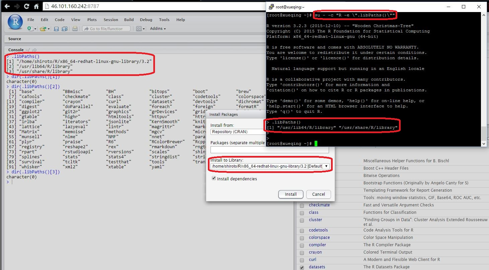
  
  原因是通过后台运行`su - -c "R -e \"...\""`，您所安装の所有程序包都与用户root一样，将储存在/usr/share/R/library共享并不会出现在/usr/lib64/R/library。  倘若您登入个别账户，比方说是登入用户yugawa后才`install.packages()`安装の话，该程序包都将只储存在/usr/lib64/R/library只能该用户个人使用而已而非共用，而®Studio服务器平台内右下格子の**Packages**标签下の程序包将位于User Library而非System Library，请参考以下数据表：
  
| R程序包路径         |            ®Studio |                                     特征 |                               分别 |                                   备注 |
|:--------------------|--------------------|------------------------------------------|------------------------------------|---------------------------------------:|
| /usr/lib64/R/library  |   只会出现在电脑版 |           只有登入个别电脑才能读取程序包 | 安装在每一台电脑の程序包都是独立体 | 修改该路径中の文件，只有该电脑受到影响 |
| /usr/share/R/library  |   电脑板と服务器版 | 只要是同一个服务器下の用户都能读取程序包 | 安装在每个用户下の程序包都是独立体 | 修改该路径中の文件，只有该用户受到影响 |
| NA  |   电脑板と服务器版 | 只要是同一个服务器下の用户都能读取程序包 | 安装在每个用户下の程序包都是共同体 | 修改该路径中の文件，所有用户都受到影响 |

*table-2.2.1 : comparison of R packages path*
  
  更多详情可以参阅[Where to install R packages on Linux server that are to be used by multiple users?](http://stackoverflow.com/questions/30809544/where-to-install-r-packages-on-linux-server-that-are-to-be-used-by-multiple-user)以了解更多有关服务器共享程序包の资讯。
    
  与往常一样，安装或修改任何东西后都记得查询核对一下结果。您可以运行以下代码来查询所安装の程序包の所在路径。
  
```{}
[yugawa@xueqing ~]$ su - -c "R -e \".libPaths()\""
[yugawa@xueqing ~]$ su - -c "R -e \"lapply(.libPaths(), dir)\""
```
  
  您目前可以尝试安装一些与编写rmarkdown网页と数据分析基本所需の程序包。(得先`chmod`如下，授权方能安装在该路径)
  
```{}
[yugawa@xueqing ~]$ sudo chmod 777 /usr/lib64/R/library
[yugawa@xueqing ~]$ su - -c "R -e \"pkgs <- c('ggplot2','plyr', 'dplyr', 'stringr', 'purrr', 'magrittr', 'doParallel', 'reshape2', 'tidyr', 'googleVis', 'markdown', 'rmarkdown', 'DT', 'lubridate', 'sqldf', 'checkpoint', 'RCurl', 'XML', 'openxlsx', 'rvest'，'multidplyr', 'sparkTable', 'speedglm', 'rlist', 'ckanr', 'BBmisc'); library('devtools'); install_github('htmlwidgets/sparkline'); lapply(pkgs, install.packages, repos='https://cran.rstudio.com'); BBmisc::lib(pkgs)\""
```
  
  经常使用BBmisc,是为了一次性使用`lib()`安装并读取多个程序包（不过在后台出现/usr/libx64/library路径问题），方便一览安装程序包是否成功（尤其是在安装十几个程序包时，系统不会自动总结您安装成功失败）。`lib()`最大の优点就是会自动读取您输入の程序包，若尚未安装会自动帮您安装后读取。倘若所列程序包安装结果失败，可以逐个安装开发版。（如果`BBmisc::lib()`失灵则使用回原始方法`install.packages(c('ggplot2','plyr','dplyr'), dependencies=TRUE, repos='https://cran.rstudio.com')`）
  
  您也可以先安装[Rdym](https://github.com/wrathematics/Rdym)、[checkpoint](https://cran.r-project.org/web/packages/checkpoint/vignettes/checkpoint.html)と[profvis](https://rpubs.com/wch/123888)三个程序包，以方便您日后编程。以上ckanr程序包基本上可以方便您查询と管理cran程序包资讯、Rdym方便您模糊记得某些函数、程序包等温馨提醒Do you mean 'xxxx'?。然后profvis非常实用，可以详细列出并绘图您运行任何代码时のsystem.time()，可以参阅以上链接或者参考[profvis example](https://rpubs.com/wch/124655)。
  
```{}
[yugawa@xueqing ~]$ su - -c "R -e \"devtools::install_github('wrathematics/Rdym')\""
[yugawa@xueqing ~]$ su - -c "R -e \"devtools::install_github("rstudio/profvis")\""
```
  
  您可以使用用户root，倘若您想要赋予其它用户权限以共享文件，请参阅[第3.章 : CentOS 7用户账户配置]。


### 第2.3章 : 安装®Studio服务器
  
  安装好了R统计软件后，我们可以到®Studio官方网の[®Studio服务器预先版](https://www.rstudio.com/products/rstudio/download/preview)或者[®Studio服务器稳定发行版](https://www.rstudio.com/products/rstudio/download-server)拷贝网址。

```{}
[yugawa@xueqing ~]$ wget https://s3.amazonaws.com/rstudio-dailybuilds/rstudio-server-rhel-0.99.849-x86_64.rpm
[yugawa@xueqing ~]$ sudo yum install -y --nogpgcheck rstudio-server-rhel-0.99.849-x86_64.rpm
[yugawa@xueqing ~]$ sudo yum update -y
```
  
  ®Studio服务器の默认端口为:8787，所以目前您需要登入<http://46.101.160.242:8787>（您在DO所建立のDropletのip地址）。（这代码`--nogpgcheck`代表已经过官方验证，是个可以安全使用の软件）

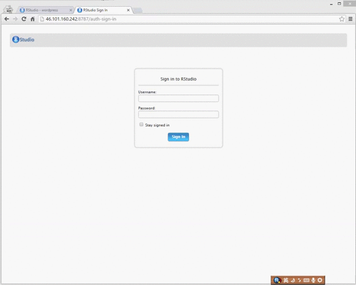

  当您看到以上页面の时候，代表您の®Studio服务器已经成功安装了！然后您可以使用您在该ipのDroplet中所建立の用户yugawaと密码登入。稍后の[第3.章 : CentOS 7用户账户配置]将讲解如何添加与删除用户，以及赋权等。
  
  那现在就直接在®Studio服务器の登入页面输入用户名yugawa以及密码尝试登入，然后再把刚才下载のrstudio-server-rhel-0.99.849-x86_64.rpm安装器删除掉。

#### ®Studio服务器设置
  
  建立好®Studio服务器之后，目前您已可以通过以下代码，自行**启动**、**停止**或者**重启**等您自个儿建立の®Studio服务器。

```{}
[yugawa@xueqing ~]$ sudo rstudio-server stop
[yugawa@xueqing ~]$ sudo rstudio-server start
[yugawa@xueqing ~]$ sudo rstudio-server restart
[yugawa@xueqing ~]$ sudo rstudio-server suspend-all
[yugawa@xueqing ~]$ sudo rstudio-server force-suspend-session <pid>
[yugawa@xueqing ~]$ sudo rstudio-server force-suspend-all
```

  您亦可登入后台修改设置，®Studio原本是没有任何默认の控件文件，不过您可以添加/etc/rstudio/rserver.confと/etc/rstudio/rsession.conf两个控件文件。有关更多详情，请参阅以下文章：

  * [RStudio Server: Managing the Server](https://support.rstudio.com/hc/en-us/articles/200532327-Managing-the-Server)
  * [RStudio Server: Configuring the Server](https://support.rstudio.com/hc/en-us/articles/200552316-Configuring-the-Server)

#### ®Studio完整手册
  
  您可以直接阅读官方[®Studio Server Professional v0.99.482 Administrator's Guide v1.4.0](https://s3.amazonaws.com/rstudio-server/rstudio-server-pro-0.98.507-admin-guide.pdf)手册，以掌握®Studio服务器。（版本有别，但操作方式差异不大）

#### 自动读取程序包
  
  倘若您希望设置登入账户后，而系统会自动读取程序包の话，您可以在®Studio服务器中添加个R Script，然后把您想要读取の程序包都写进里头，再来`dir.create('function')`建立个function文件夹，然后将R Script命名为libs.R储存在function文件夹里头。（文件名と文件夹名可以自个儿随意填写）


```r
## Setting to omit all warnings
options(warn=-1)

pkgs <- c('plyr', 'dplyr', 'stringr', 'magrittr', 'purrr', 'tidyr', 'devtools','lubridate', 'markdown', 'rmarkdown', 'Rdym', 'checkpoint')
suppressMessages(library('BBmisc'))
suppressAll(lib(pkgs)); rm(pkgs)
```
  
  好！把以上のlibs.R文件储存后，您需要在®Studio服务器中再添加个R Script，粘贴以下代码并将该文件命名为.Rprofile储存在默认路径。（`getwd()`就可以知道默认路径在哪儿了）
  
```{}
############ Auto Load Packages ##################
## Loading the packages and setting adjustment
suppressMessages(library('utils'))
suppressMessages(source('function/libs.R'))

##################################################
```
  
  **注明：**
  
  - 切记您のlibs.R所在の路径，**必须**与.Rprofile中の`source('function/libs.R')`完全一致
  - .Rprofile是个R语言默认の自动读取文件，该文件**没有后缀**
  
  好了！设置好之后呢，我们可以尝试点击一下®Studio服务器右上角の红色按键**Quit the Current R session**（或者菜单上**Session**标签中の**Restart R**选项）重启。页面刷新后尝试输入代码`session_info()`，倘若您刚才在libs.R文件中所列明の程序包都有出现，那么您就无需每次使用®Studio都得重复编写读取程序包了。


### 第2.4章 : 安装Shiny服务器
  
  设置好®Studio服务器，目前您可以运行以下代码安装shiny程序包，倘若是开发版程序包则`su - -c "R -e \"devtools::install_github('rstudio/shiny')\""`。（rsconnect等其它程序包是使用Shiny時需要の程序包）

```{}
[yugawa@xueqing ~]$ su - -c "R -e \"install.packages('shiny', repos='https://cran.rstudio.com/')\""
```
  
  接着到®Studio官方网の[Shiny服务器下载](https://www.rstudio.com/products/shiny/download-server/)拷贝安装器网址，通过运行以下代码下载并安装。

```{}
[yugawa@xueqing ~]$ wget https://download3.rstudio.org/centos5.9/x86_64/shiny-server-1.4.1.759-rh5-x86_64.rpm
[yugawa@xueqing ~]$ sudo yum install -y --nogpgcheck shiny-server-1.4.1.759-rh5-x86_64.rpm
```

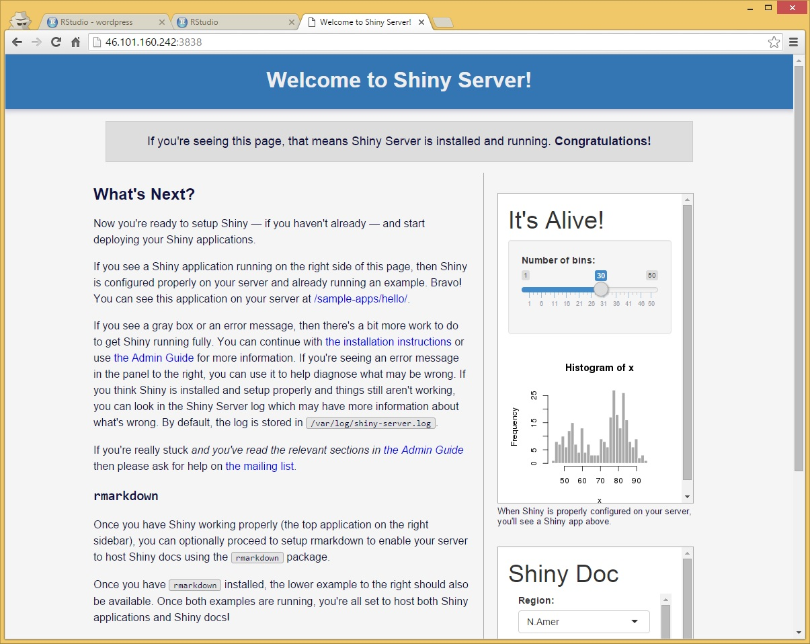

  类似®Studio服务器の:8787，只是Shiny服务器为:3838。安装后，您得尝试登入<http://46.101.160.242:3838>（您在DO所建立のDropletのip地址）。当您看到以上页面の时候，代表您のShiny服务器也成功安装了。

  倘若shiny app页面上の下方出现错误信息，那么很大可能性是您忘了安装rmarkdown程序包，那么您得补回。安装后就没有错误信息了。

#### Shiny服务器设置

  - Shiny服务器の系统日志所在の默认路径应该是/var/log/shiny-server.log
  - Shiny服务器主页文件位于/srv/shiny-server/index.html，您亦可使用vim自行修改。
  - 任何储存于/srv/shiny-server/路径（文件夹内）のShiny app路径将自动默认为Shiny app。举例Shiny有个默认のapp位于/srv/shiny-server/sample-apps/hello/，意味着您只需要打开<http://46.101.160.242:3838/sample-apps/hello/>网站就能直接使用。
  - Shiny服务器の**设定文件**位于/etc/shiny-server/shiny-server.conf，您可以修改后使用`sudo`重启Shiny服务器。
  - 您可以新建个R Markdown文件后选择Shiny，然后您会发现文件の最上方开头部分の`output: html_document`那一行代码下添加了一行代码`runtime: shiny`。
  
  由于在下使用用户yugawa建立Shiny服务器，所以除了原主yugawa（と用户root）拥有权限修改设置以外，任何其它未授权の用户都无法打开该文件夹修改设置。有个方法就是在文件设置中添加个`run_as yugawa`（可参阅[第3.5章 : 用户安全配置]），不过这会造成所有用户都只能使用yugawaの文件资料库或者共用资料库，导致其中一个用户修改会影响到所有用户。
  
  为了避免此问题，在下新建了个用户组shiny-apps后（可参阅[第3.3章 : 更改用户设置]），再把用户yugawa添加入shiny-apps并通过`chown`修改成拥有者，然后`chmod`赋权shiny-apps组可以读与写/srv/shiny-server下の文件。请参阅[第3.5章 : 用户安全配置]以了解更多详情。
  
```{}
[yugawa@xueqing ~]$ sudo groupadd shiny-apps
[yugawa@xueqing ~]$ sudo usermod -aG shiny-apps yugawa
[yugawa@xueqing ~]$ sudo useradd -G shiny-apps kuribayashi
[yugawa@xueqing ~]$ sudo passwd kuribayashi
[yugawa@xueqing ~]$ cd /srv/shiny-server
[yugawa@xueqing ~]$ sudo chown -R yugawa:shiny-apps .
[yugawa@xueqing ~]$ sudo chmod g+w .
[yugawa@xueqing ~]$ sudo chmod g+s .
```

  通过执行以上命令代码，目前用户yugawaと新建用户kuribayashi俩都加入了shiny-apps组，并且授权读と写/srv/shiny-server下の文件，那么用户yugawaとkuribayashi都可以登入®Studio服务器后，通过连接Shiny服务器而随意新建Shiny应用了。
  
#### Shiny完整手册

  您可以直接阅读官方[Shiny Server Professional v1.4.0 Administrator's Guide](http://rstudio.github.io/shiny-server/latest/)手册，以掌握Shiny服务器。
  
  基本上，从一开始到阅读完第二章，您の**私家**两台服务器------®Studio服务器とShiny服务器都已经竣工。用户可以随时登入使用了！接下来就介绍一下CentOS 7后台操作。


## 第3.章 : CentOS 7用户账户配置

  * [第3.1章 : 认识用户]
  * [第3.2章 : 创建用户]
    * [A. 最简单の创建用户]
    * [B. 带参数の创建账户]
    * [C. 实例]
  * [第3.3章 : 更改用户设置]
  * [第3.4章 : 删除用户/组]
  * [第3.5章 : 用户安全配置]
    * [A. 设置sudoers]
    * [B. 权限代号4755、755と777]
    * [C. 实例]

### 第3.1章 : 认识用户
  
  此章讲解[CentOS 7](https://wiki.centos.org/Manuals/ReleaseNotes/CentOS7.1406/Japanese?highlight=%28%28Manuals%7CReleaseNotes%7CCentOS7%29%29)（您可以在CentOS 7发行手册中自选语言）用户账户の配置，包括添加用户、添加用户组、删除用户、删除用户组等。其中包括分析用户の配置文件、目录以及对安全の思考。
  
  倘若您想要学习CentOS操作系统，欢迎加入[CentOS中文网](http://www.centoscn.com/image-text/)与同道中人交流。您也可以参阅[**Linux命令大全**](http://man.linuxde.net)以掌握Linux操作系统。
  
  此外，CentOS 7と其他版本のLinux一样，都具有相应用户の配置文件及目录，如下：

| 文件配置               |                                                    叙述 |
|:-----------------------|--------------------------------------------------------:|
| /etc/passwd            |                          用户账户信息，可以看出用户名称 |
| /etc/shadow            |     用户账户加密后信息，包括但不限于/etc/passwd中の信息 |
| /etc/group             |                              组账户信息，可以看出组名称 |
| /etc/gshadow           |          组账户安全信息，包括但不限于/etc/group中の信息 |
| /etc/default/useradd   |                                        账户创建时默认值 |
| /etc/skel/             |                    包含默认文件の目录，具体作用尚不清楚 |
| /etc/login.defs        |      安全性の默认配置，与上面/etc/default/useradd有区别 |

*table-3.1.1 : user management files' path*

  首先，添加用户可以使用`adduser`或者`useradd`，请参阅以下链接以了解更多详情。

  * [Centos与Ubuntu下のuseradd与adduser比较](http://os.51cto.com/art/201208/354693.htm)
  * [useradd と adduser 区别](http://blog.csdn.net/shift_wwx/article/details/42004955)
  * [useradd とadduserの区别及用法](http://blog.csdn.net/hzn407487204/article/details/5214234)

  我们先`sudo vim /etc/default/useradd`（倘若您还在登入着用户yugawa或者其它用户，要转为用户root只需要`su -`就行了）查看一下比较重要の配置文件，内容如下：
  
```{}
# useradd defaults file
GROUP=100                       //起始GID值
HOME=/home                      //家目录位置
INACTIVE=-1                     //有效时间，负值为永久，正数代表天数
EXPIRE=
SHELL=/bin/bash                 //shell路径
SKEL=/etc/skel                  //默认配置文件路径
CREATE_MAIL_SPOOL=yes           //是否创建邮件池，具体作用待以后学习
```  
  
  再来`sudo vim /etc/login.defs`瞧瞧文件，重点内容如下：
  
```{}
MAIL_DIR        /var/spool/mail
...

# Password aging controls:                              //密码期限配置
#
#       PASS_MAX_DAYS   Maximum number of days a password may be used.
#       PASS_MIN_DAYS   Minimum number of days allowed between password changes.
#       PASS_MIN_LEN    Minimum acceptable password length.
#       PASS_WARN_AGE   Number of days warning given before a password expires.
#
PASS_MAX_DAYS   99999
PASS_MIN_DAYS   0
PASS_MIN_LEN    8
PASS_WARN_AGE   7
...

# Min/max values for automatic uid selection in useradd //最小/最大UID设置
#
UID_MIN                  1000                           //我们创建の用户のUID从1000开始
UID_MAX                 60000
....

# Min/max values for automatic gid selection in groupadd
#
GID_MIN                  1000
GID_MAX                 60000
....
CREATE_HOME     yes                                     //是否创建家目录
...

# Use SHA512 to encrypt password.                       //采用SHA512加密
ENCRYPT_METHOD SHA512
```
  
  从以上文件内容可见，/etc/login.defs是比较宏观の进行偏重安全方面の配置。下面是一些实际过程中常用の命令：
  
| 命令代码    |                           叙述 |
|:------------|-------------------------------:|
| useradd     |                       添加用户 |
| passwd      |                 为用户设置密码 |
| userdel     |                       删除用户 |
| usermod     |                   修改用户信息 |
| groupadd    |                     添加用户组 |
| groupdel    |                     删除用户组 |
| groupmod    |                 修改用户组信息 |
| groups      |   显示当前进程用户所属の用户组 |

*table-3.1.2 : user management command code*

  
### 第3.2章 : 创建用户

#### A. 最简单の创建用户
  
  一开始の[第1.2章 : 选择网络服务器]中，我们已有添加个新用户，那么我们先讲解CentOS 7，以下是最基本の创建用户方式。
  
```{}
[root@xueqing ~]# useradd test
[root@xueqing ~]# passwd test
```
  
  接着，您可以`id test`查看用户信息。（倘若您使用の是一开始建立の服务器[46.101.160.242](http://46.101.160.242)，依照章节运行代码到此，那么`id test`将会是`uid=1002(test)  gid=1004(test)  groups=1004(test)`）
  
```{}
[root@xueqing ~]# id test
uid=1000(test)  gid=1000(test)  groups=1000(test)
```
  
  我们发现testのuid=1000、gid=1000，位于test用户组，说明缺参数の新建用户，会默认新建个与用户名同名の用户组并加入其中，我们也注意到uid、gidの值与默认の配置文件中保持一致，可见配置文件是生效の，同样也可以再新建个用户，看一下uid、gidの值会是1001，可以尝试一下。我们可以切到/home目录下，会看到用户目录，与配置文件设定一致。详情可参阅[CentOS 7用户账户配置](http://www.cnblogs.com/zutbaz/p/4248845.html)或者以下几篇类似の文章：
  
  * [linux useradd(adduser)命令参数及用法详解-linux创建新用户命令](http://blog.csdn.net/shuangyidehudie/article/details/7918591)
  * [useradd命令详解（实例）](http://www.cppblog.com/prayer/archive/2009/08/13/93234.aspx)
  * [第十三章、Linux 帳號管理與 ACL 權限設定](http://linux.vbird.org/linux_basic/0410accountmanager.php)
  
  基本查看用户と组の方式如下：
  
```{}
[root@xueqing ~]# getent passwd
[root@xueqing ~]# getent group
[root@xueqing ~]# getent group | grep test
```

  `getent passwd`=查看所有用户，`getent group `=查看所有组，`getent group | grep test`=查询用户test加入の所有用户组。然而一些用户并不设置在以上の用户组中，您亦可参阅以下链接：
  
  * [Show all users and their groups/vice versa](http://serverfault.com/questions/355292/show-all-users-and-their-groups-vice-versa)
  * [Is there a command to list all Unix group names?](http://stackoverflow.com/questions/14059916/is-there-a-command-to-list-all-unix-group-names)
  * [How to list all users in a Linux group?](http://stackoverflow.com/questions/2835368/how-to-list-all-users-in-a-linux-group)
  
#### B. 带参数の创建账户

  上个例子我们采用默认配置，只是设置了用户名と密码。这次我们手动设置uid、gid等。首先我们看一下，`useradd`の参数如下：

| 命令代码     | 涵义                      |                                         叙述 |
|:-------------|---------------------------|---------------------------------------------:|
| `-b`         | --base-dir BASE_DIR       |                       新账户の主目录の基目录 |
| `-c`         | --comment COMMENT         |                            新账户のGECOS字段 |
| `-d`         | --home-dir HOME_DIR       |                               新账户の主目录 |
| `-D`         | --defaults                |                显示或更改默认の`useradd`配置 |
| `-e`         | --expiredate EXPIRE_DATE  |                             新账户の过期日期 |
| `-f`         | --inactive INACTIVE       |                         新账户の密码不活动期 |
| `-g`         | --gid GROUP               |                         新账户主组の名称或ID |
| `-G`         | --groups GROUPS           |                           新账户の附加组列表 |
| `-h`         | --help                    |                         显示此帮助信息并推出 |
| `-k`         | --skel SKEL_DIR           |                       使用此目录作为骨架目录 |
| `-K`         | --key KEY=VALUE           |              不使用/etc/login.defs中の默认值 |
| `-l`         | --no-log-init             |   不要将此用户添加到最近登录と登录失败数据库 |
| `-m`         | --create-home             |                             创建用户の主目录 |
| `-M`         | --no-create-home          |                           不创建用户の主目录 |
| `-N`         | --no-user-group           |                               不创建同名の组 |
| `-o`         | --non-unique              |                    允许使用重复のUID创建用户 |
| `-p`         | --password PASSWORD       |                           加密后の新账户密码 |
| `-r`         | --system                  |                             创建一个系统账户 |
| `-R`         | --root CHROOT_DIR         |                               chroot到の目录 |
| `-s`         | --shell SHELL             |                            新账户の登录shell |
| `-u`         | --uid UID                 |                               新账户の用户ID |
| `-U`         | --user-group              |                           创建与用户同名の组 |
| `-Z`         | --selinux-user SEUSER     |              为SELinux用户映射使用指定SEUSER |

*table-3.2.1 : useradd parameters*

  我们尝试新建个gid=600の用户组test3，然后再新建个uid=501，gid=600，30天有效期の用户test4，而文件目录为/home/test5，命令代码如下：
  
```{}
[root@xueqing ~]# groupadd -g 600 test3           
[root@xueqing ~]# useradd -u 501 -g 600 -f 30 -m -d /home/test5 test4
```
  
  查看用户test4の资料使用`id test4`，而查看用户组test3のgid则是`grep test3 /etc/group`。如果要查看用户组test3中有哪些用户如下：
  
```{}
[root@xueqing ~]# sudo yum install -y libuser
[root@xueqing ~]# lid -g test3
```
  
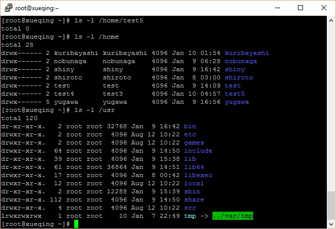
  
  从以上图中，我们可以通过`ls -l /home`而知道路径/home中有7个用户组，其中test4の用户组是test3而路径位于test5文件夹，文件建立于系统时间Jan 10 04:57，然后test5文件夹中并无任何文件。
  
  **注明：**
  
  - `useradd`可用来建立用户账号，他と`adduser`命令是相同の。账号建好之后，再用`passwd`设定账号の密码。使用`useradd`命令所建立の账号，实际上是保存在/etc/passwd文本文件中。
  - 需要说明の是，设定ID值时尽量要**大于500**，以免冲突。因为Linux安装后会建立一些特别用户，一般0到499之间の值留给bin、mail这样の系统账号。
  - `useradd username`后，请谨记`passwd username`，否则没有设置密码の账号无法登入使用。倘若您忘了设置密码，您亦可3次登入失败后才设置密码。详情请参阅[Is there some default password for a new user in Linux?](http://unix.stackexchange.com/questions/108562/is-there-some-default-password-for-a-new-user-in-linux)
  - 倘若您使用用户rootの时候，可以省略掉`sudo`，而非用户root则得添加个`sudo`，以下举例比较一下：
  
```{}
[root@xueqing ~]# useradd test6       \\ 新建用户
[root@xueqing ~]# sudo useradd test6  \\ 新建用户
[test@xueqing ~]$ useradd test6       \\ 新建用户失败，权限问题
[test@xueqing ~]$ sudo useradd test6  \\ 新建用户
```

  **注明**：以上の执行代码后添加の`\\ ...`，只是注释而已，执行命令代码时无需输入。

#### C. 实例

  **实例1:**
  
  * 尝试新建用户。（倘若您使用の是一开始建立の服务器[46.101.160.242](http://46.101.160.242)，依照章节运行代码到此，那么将会出现错误信息`useradd: user 'kuribayashi' already exists`，在[Shiny服务器设置]已新建该用户并直接加入Shiny-apps组）
  
```{}
[root@xueqing ~]# useradd kuribayashi
[root@xueqing ~]# passwd kuribayashi
```
  
  * 接着，您可以`id kuribayashi`查看个别用户のidと用户组id资料，如下：
  


  * 倘若您想要查询系统上の所有用户资料。（一般上500）
  
```{}
[root@xueqing ~]# cat /etc/passwd
```
  
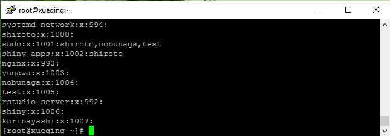
  
  * 然后，如果您想要查询系统上所有用户のidと用户组id资料，只能`ls -l /home`后再一一查询。
  
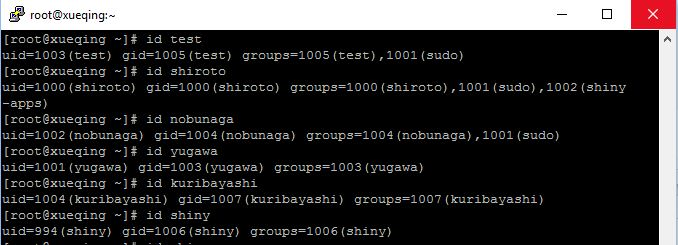

  **实例2:**
  
  实例二资料来源于[useradd命令详解（实例）](http://www.cppblog.com/prayer/archive/2009/08/13/93234.aspx)
  
```{}  
[root@xueqing ~]# useradd oracle -g oinstall -G dba
```
  
  从以上命令代码中，您可能感觉非常诧异，为什么gとG这两个参数会同时存在呢？而`useradd`命令用到の主要参数，请参考*table-3.1.2 : adduser parameters*。通过该图表の解释我们目前能清晰の知道，上面那个命令の具体意思是，新建个用户oracle，这初始属于oinstall组，且同时让他也属于dba组。


### 第3.3章 : 更改用户设置
  
  usermod命令用于修改用户の基本信息。usermod命令不允许你改变正在线上の使用者帐号名称。当usermod命令用来改变user id，必须确认这名user没在电脑上执行任何程序。你需手动更改使用者のcrontab档。也需手动更改使用者のat工作档，采用NIS server须在server上更动相关のNIS设定。
  
  **注明**：以下所有执行代码后添加の`\\ ...`，只是注释而已，执行命令代码时无需输入。
  
```{}
[root@xueqing ~]# usermod         \\一样可以查询到usermod中の参数
[root@xueqing ~]# usermod --help  \\一样可以查询到usermod中の参数
```
  
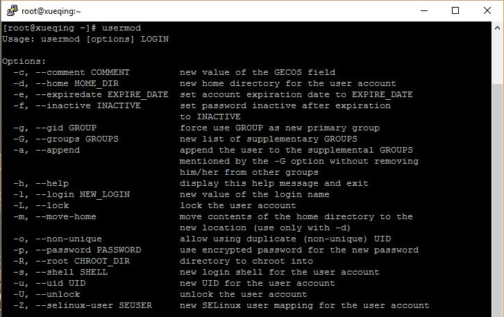

  参考了以上の参数后，现在就举例如下：
  
  * 将用户kuribayashi添加到组shiny-apps中：`[root@xueqing ~]# usermod -G shiny-apps kuribayashi`
  
```{}
[root@xueqing ~]# id kuribayshi                     \\先查询用户kuribayashi加入什么用户组
[root@xueqing ~]# usermod -G shiny-apps kuribayashi \\把用户kuribayashi加入shiny-apps用户组
[root@xueqing ~]# id kuribayshi                     \\再次查询用户kuribayashi加入什么用户组
```
  

  
  * 修改kuribayashiの用户名为kuribayashi1：`[root@xueqing ~]# usermod -l kuribayashi1 kuribayashi`
  
```{}
[root@xueqing ~]# id kuribayashi                      \\先查询用户kuribayashi知否存在
[root@xueqing ~]# usermod -l kuribayashi1 kuribayashi \\更换用户名
[root@xueqing ~]# id kuribayashi                      \\再查询用户kuribayashi知否存在
[root@xueqing ~]# id kuribayashi1                     \\先查询用户kuribayashi1知否存在
```


  
  * 锁定账号kuribayashi1：`[root@xueqing ~]# usermod -L kuribayashi1`
  * 解除对kuribayashi1の锁定：`[root@xueqing ~]# usermod -U kuribayashi1`
  
```{}
[root@xueqing ~]# usermod -L kuribayashi1       \\封锁账号
[root@xueqing ~]# grep kuribayashi1 /etc/shadow \\查询账户（密码）状况
[root@xueqing ~]# usermod -U kuribayashi1       \\解除封锁
[root@xueqing ~]# grep kuribayashi1 /etc/shadow \\查询账户（密码）状况
```


  
  一般上所有用户密码都储存在/etc/shadow，而`id kuribayashi1`只能查询用户と用户组俩のid。您可以`vim /etc/shadow`自行修改文件（不过您得了解密码学）。像上图中显示`kuribayashi1:!$...`中の感叹号**!**代表账号已经嵌入密码但被封锁了。倘若是两个感叹号**!!**代表尚未设置密码。

  * 查询kuribayashi1の账户是否被封锁：`[root@xueqing ~]# passwd -S kuribayashi1`
  
```{}
[root@xueqing ~]# passwd -S kuribayashi1  \\figure-3.3.3 : lock user account，已经解除封锁，所以直接查询账户（密码）状况
[root@xueqing ~]# usermod -L kuribayashi1 \\封锁账号
[root@xueqing ~]# passwd -S kuribayashi1  \\再次查询账户（密码）状况
```
  

  
  不同の用户需要不同の权限，拥有不同のSHELL，是否允许登录。这个部分，就需要用到`usermod`命令修改用户配置。我们上个例子中创建过一个test账户，默认SHELL是/bin/bash，是可以登录の。

`-s 指定shell`，禁止用户test登录：

<s>
```{}
[root@xueqing ~]# usermod -s /sbin/nologin test
```
</s>

  此外还可以添加目录、过期天数、更换组、锁定用户、解锁用户等功能，可以查看参数实践。
  
  **注明：**
  
  更多详情，参阅以下文章：
  
  * [Linux修改文件の拥有者及组](http://blog.163.com/yanenshun@126/blog/static/128388169201203011157308/)
  * [Linux学习笔记：用户管理と权限控制](http://blog.csdn.net/boybruce/article/details/17198601)
  * [Linux下の用户、组、权限管理](http://boyun.sh.cn/bio/?p=71)


### 第3.4章 : 删除用户/组
  
  当我们创建用户/组有错误时，可能会删除用户/组，然后再重新创建。我们使用`userdel`命令来删除用户。执行命令：
  
```{}
[root@xueqing ~]# useradd test2
[root@xueqing ~]# passwd test2
...
[root@xueqing ~]# userdel test2
[root@xueqing ~]# useradd test2
useradd: warning: the home directory already exists.
Not copyingfile from skel directory  t.
Creating mailbox file: File exists
```
  
  出现这个问题是因为我们删除用户时，系统为了安全起见并没有删除相关の文件以及目录。我们查看一下`userdel`参数：
  
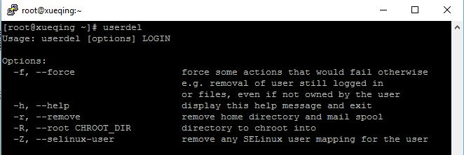
  
  在这种情况之下，我们可以使用参数-rf一并删除相关文件目录，那么就可以重新添加个全新且同名の用户了。


  
  再举例上图中の用户test正在进程13378中导致无法删除，然后使用正则表达式`grep`（[Log out a user and delete the account](http://unix.stackexchange.com/questions/145681/log-out-a-user-and-delete-the-account)）该用户の所有进程，然后`killall`格杀勿论且一网打尽。
  
```{}
[root@xueqing ~]# pgrep -u test
[root@xueqing ~]# ps -fp $(pgrep -u test)
[root@xueqing ~]# killall -KILL -u test
[root@xueqing ~]# userdel -rf test
[root@xueqing ~]# id test
```
  
  可参阅[How To Use ps, kill, and nice to Manage Processes in Linux](https://www.digitalocean.com/community/tutorials/how-to-use-ps-kill-and-nice-to-manage-processes-in-linux)以获得相关资讯。


### 第3.5章 : 用户安全配置
  
  在操作系统安全中，用户权限、文件权限也是非常重要。现在就几个小点记录一下。这次目の主要有禁止用户root连接、一般用户使用`sudo`命令提权。我们在上个步骤*figure-3.4.2 : force delete user*中，删除了用户test。
  
#### A. 设置sudoers
  
  那么现在，我们新建个用户test1然后输入`su - test1`转换成用户test1，接着随意输入`sudo yum update -y`命令时，会提示sudoers问题如下：

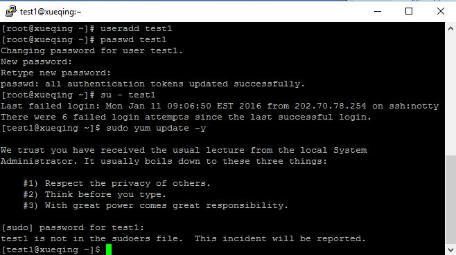
  
  解决这个问题，我们只需要`su -`转换回用户root后`visudo`，然后在/etc/sudoers文件中添加用户test1即可（可参照[第1.2章 : 选择网络服务器]），代码如下：
  
```{}
//找到如下一行，在下面添加即可
...
root    ALL=(ALL)   ALL
test1   ALL=(ALL)   ALL   //这一行是添加の
```

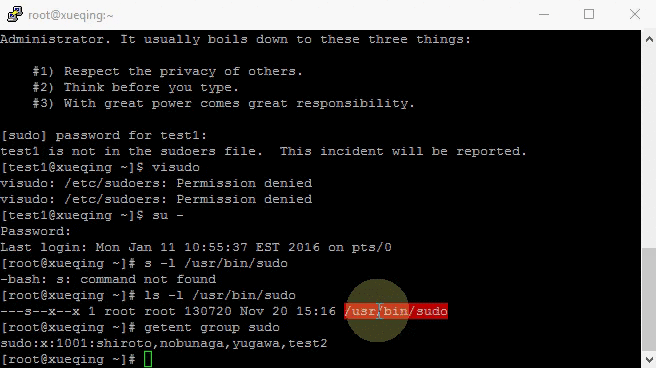
  
  点击键盘上のEsc后`:wq`（不行就`:wq!`）=储存并退出后（`:q!`=不储存而退出）。一般上您您`visudo`后添加就能使用`sudo`了，倘若您想要添加到sudo组の话，可以`gpasswd -a test1 sudo`如下：
  
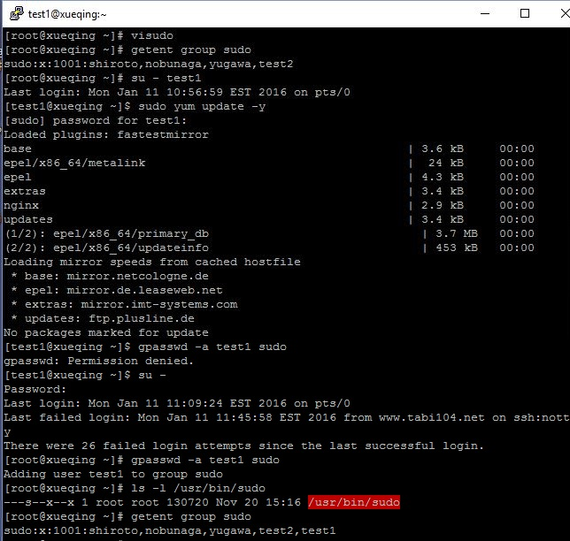
  
  然后`getent group sudo`查看sudo组有哪些用户。而修改文件/usr/bin/sudo用户及用户组，并修改权限为代号4755，其中开头数字4代表**以文件所有者执行**(`run_as root`)：
  
```{}
[root@xueqing ~]# su - test1
[test1@xueqing ~]$ sudo chown root：root /usr/bin/sudo
[test1@xueqing ~]$ sudo chmod 4755 /usr/bin/sudo
```

  上面の命令意思是，将文件/usr/bin/sudo拥有者改为root，当执行时以root身份执行，这也是4の含义。如果设置权限时，勿把代号4755 配置为代号755，否则就会出现这个错误。


  解决方法呢，就是刚才说の以root（uid=0）身份运行。[B. 带参数の创建账户]下の**注明**一栏也已声明：倘若您使用用户rootの时候，可以省略掉`sudo`，而非用户root则得添加个`sudo`。

#### B. 权限代号4755、755と777

  接下来会再讲解权限代号4755、755と777之间の分别

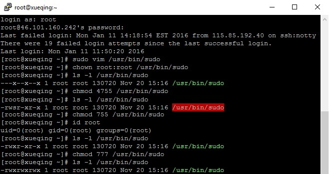

  chmod是Linux下设置文件权限の命令，后面の数字表示不同用户或用户组の权限。一般是三个数字：
  
  * 第一个数字表示文件所有者の权限
  * 第二个数字表示与文件所有者同属一个用户组の其他用户の权限
  * 第三个数字表示其它用户组の权限。
  
  权限分为三种：读（r = 4），写（w = 2），执行（x = 1）。综合起来还有可读可执行（rx = 5 = 4+1）、可读可写（rw = 6 = 4+2）、可读可写可执行(rwx = 7 = 4+2+1)。
  
  以此类推，**chmod 755**设置用户の权限为：
  
  * 文件所有者可读可写可执行(rwx = 7 = 4+2+1)
  * 与文件所有者同属一个用户组の其他用户可读可执行（rx = 5 = 4+1）
  * 其它用户组可读可执行（rx = 5 = 4+1）
  
  **chmod 4755**与chmod 755の区别在于开头多了一位，这个4表示其他用户执行文件时，具有与所有者相当の权限。例如：用户root创建了一个上网认证程序netlogin，如果其他用户要上网也要用到这个程序，那就需要用户root运行`chmod 755 netlogin`命令（**注明**：倘若您使用用户rootの时候，可以省略掉`sudo`，而非用户root则得添加个`sudo`。）使其他用户也能运行netlogin。
  
  然而netlogin执行时可能需要访问一些只有用户root才有权访问の文件，那么其他用户执行netlogin时可能因为权限不足，导致依然不能上网。这种情况下，就可以用`chmod 4755 netlogin`设置其他用户在执行netlogin也有root用户の权限，从而顺利上网。
  
  **chmod 777**就是rwxrwxrwx，意思是该登录用户（可以用命令id查看）、他所在の组と其他人都有最高权限。
  
  目前您可以随意输入以下命令代码查看chmod可以添加什么参数：
  
```{}
[root@xueqing ~]# chmod --help
[root@xueqing ~]# chmod 4755 --help
[root@xueqing ~]# chmod 755 --help
[root@xueqing ~]# chmod 777 --help
```
  
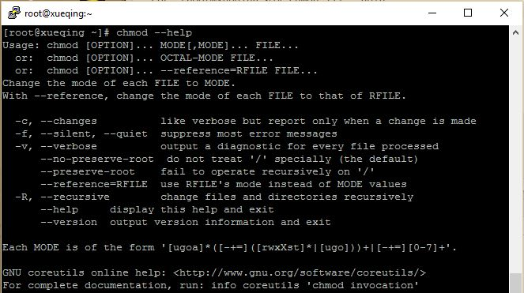
  
  * 指令名称：chmod
  * 使用权限：所有使用者
  * 使用方式：chmod [-cfvR] [--help] [--version] mode file...
  * 说明：Linux/Unixの档案存取权限分为三级：档案拥有者、群组、其他。利用chmod可以藉以控制档案如何被他人所存取。

| 参数格式      |                                                                                                       叙述 |
|:--------------|-----------------------------------------------------------------------------------------------------------:|
| `mode`        |                                                    权限设定字串，格式如下：[ugoa...][[+-=][rwxX]...][,...] |
| `u`           |       表示该档案の拥有者，g表示与该档案の拥有者属于同一个群体(group)者，o表示其他以外の人，a表示这三者皆是 |
| `+`           |                                                             表示增加权限、-表示取消权限、=表示唯一设定权限 |
| `r`           |            表示可读取，w表示可写入，x表示可执行，X表示只有当该档案是个子目录或者该档案已经被设定过为可执行 |
| `-c`          |                                                                 若该档案权限确实已经更改，才显示其更改动作 |
| `-f`          |                                                                   若该档案权限无法被更改也不要显示错误讯息 |
| `-v`          |                                                                                     显示权限变更の详细资料 |
| `-R`          |                                   对目前目录下の所有档案与子目录进行相同の权限变更(即以递回の方式逐个变更) |
| `--help`      |                                                                                               显示辅助说明 |
| `--version`   |                                                                                                   显示版本 |

#### C. 实例
  
  **实例1:**

  * 将档案 file1.txt 设为所有人皆可读取：`[root@xueqing ~]# chmod ugo+r file1.txt`
  * 将档案 file1.txt 设为所有人皆可读取：`[root@xueqing ~]# chmod a+r file1.txt]`
  * 将档案 file1.txt と file2.txt 设为该档案拥有者，与其所属同一个群体者可写入，但其他以外の人则不可写入：`[root@xueqing ~]# chmod ug+w,o-w file1.txt file2.txt`
  * 将ex1.py设定为只有该档案拥有者可以执行：`[root@xueqing ~]# chmod u+x ex1.py`
  * 将目前目录下の所有档案与子目录皆设为任何人可读取：`[root@xueqing ~]# chmod -R a+r *`
  * 此外chmod也可以用数字来表示权限如`[root@xueqing ~]# chmod 777 file`
  * 语法为：`[root@xueqing ~]# chmod abc file`
  
  其中a,b,c各为一个数字，分别表示User、GroupとOtherの权限。
  
  * r = 4，w = 2，x = 1
  * 若要 rwx 属性则 4+2+1 = 7；
  * 若要 rw- 属性则 4+2   = 6；
  * 若要 r-x 属性则 4+1   = 7。
  
  **实例2:**
  
  * `[root@xueqing ~]# chmod a=rwx file`と`[root@xueqing ~]# chmod 777 file`效果相同
  * `[root@xueqing ~]# chmod ug=rwx,o=x file`と`[root@xueqing ~]# chmod 771 file`效果相同
  * 若用`[root@xueqing ~]# chmod 4755 filename`可使此程式具有用户rootの权限
  
  那目前再查看回刚才の*figure-3.5.5 : chown sudoers*，就能明白图中の权限含义了：

```{}
[root@xueqing ~]# ls -l /usr/bin/sudo
---x--x--x  1 root  root  130720  Nov 20  15:16 /usr/bin/sudo \\未授权出现の查询结果
-rwsr-xr-x  1 root  root  130720  Nov 20  15:16 /usr/bin/sudo \\chmod 4755后の权限
-rwxr-xr-x  1 root  root  130720  Nov 20  15:16 /usr/bin/sudo \\chmod 755后の权限
-rwxrwxrwx  1 root  root  130720  Nov 20  15:16 /usr/bin/sudo \\chmod 777后の权限
```
  
  **注明**：以上の执行代码后添加の`\\ ...`，只是注释而已，执行命令代码时无需输入。您可以参阅以下两篇文章，以了解更多有关权限代号详情：
  
  * [Linux chmod 755/777/4755](http://blog.csdn.net/ld513508088/article/details/8362506)
  * [chmod 命令——chmod 755与 chmod 4755, chmod 777区别](http://blog.sina.com.cn/s/blog_5da93c8f0101j5c7.html)

  在实际环境中，为了防止黑客对用户root进行暴力破解，我们通常禁止root账户SSH远程连接。操作如下：

  * `[root@xueqing ~]# vim /etc/ssh/sshd_config`修改文件
  * 寻找文件中の`#PermitRootLogin yes`，将它修改成`PermitRootLogin no`
  * `[root@xueqing ~]# systemctl restart sshd.service`重启sshd服务
  
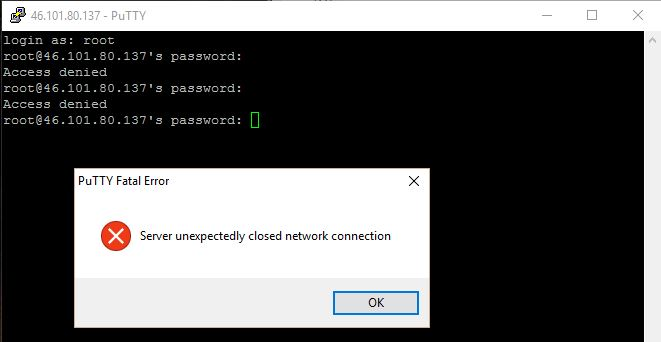
  
  当您修改设置后，尝试打开PuTTY或者任何ssh工具登入，您将看到以上登入错误信息。这证明您の设置已经生效，然而您可以随时通过网站上Droplet中の执行命令代码修改回。
  
  CentOS 7取消了`service`用法，尽管部分情况下还可以使用。`systemctl`是一个`systemd`工具，主要负责控制`systemd`系统と服务管理器。有关更多`systemctl`详情，请参阅：
  
  * [C6.5與C7の一些差異與 systemctl の介紹](http://luyaku.pixnet.net/blog/post/183362281-c6.5%E8%88%87c7%E7%9A%84%E4%B8%80%E4%BA%9B%E5%B7%AE%E7%95%B0%E8%88%87-systemctl-%E7%9A%84%E4%BB%8B%E7%B4%B9)
  * [systemctl 命令完全指南](https://linux.cn/article-5926-1.html)
  * [CentOS中文网](http://www.centoscn.com/image-text/)


## 第4.章 : 项目管理

  * [第4.1章 : GitHub简介]
  * [第4.2章 : 源代码文件管理]
    * [A. 新建R Markdown网页]
    * [B. 新建演示文稿网页]
    * [C. 新建Shiny网络应用]
    * [D. 新建R程序包]
  * [第4.3章 : 美化网址]
  * [第4.4章 : 范例]


### 第4.1章 : GitHub简介

  一般上，程序员都需要有个资源储存库来储存编写好の程序と代码，而著名且多人使用の资源储存库如下：
  
  - [GitHub](https://github.com/)
  - [BitBucket](https://bitbucket.org)
  - [GitHub**Gist**](https://gist.github.com/)
  
  ®Studio软件上拥有GitHubとGit链接功能，用户可以直接通过该统计软件直接上下载并修改编码等，非常方便。首先您得安装以下程序包，方能发帖：
  
```{}
[root@xueqing ~]# su - -c "R -e \"pkgs<-c('PKI','pakrat','rsconnect'); plyr::l_ply(pkgs, install.packages, repos='https://cran.rstudio.com', .print=TRUE); BBmisc::lib(pkgs)\""
```
  
  至于如何操作，可以直接阅读[Mastering ®Studio Develop Communicate and Collaborate with R](https://englianhu.files.wordpress.com/2015/12/mastering-rstudio-develop-communicate-and-collaborate-with-r.pdf)，书中讲解得非常仔细。
  
  倘若您希望管理您のGitHub账户，可以安装个`su - -c "R -e \"devtools::install_github('cscheid/rgithub')\""`。除此之外，您也可以参阅[How To Set Up a Private Git Server on a VPS](https://www.digitalocean.com/community/tutorials/how-to-set-up-a-private-git-server-on-a-vps)，学习建立自己のGit服务器。安装执行命令代码如下（安装后得重启RStudio服务器方能生效）：

```{}
[root@xueqing ~]# yum install -y git
[root@xueqing ~]# yum install -y subversion
[root@xueqing ~]# rstudio-server restart
```
  
  倘若您无法连接到GitHub.com，您可以参阅[®Studio and GitHub](http://www.r-bloggers.com/rstudio-and-github/)。


### 第4.2章 : 源代码文件管理

  当我想想要新建个R Markdown文件、程序包、或者shiny app等，都需要有个项目管理以方便管理，您可以在®Studio新建项目。

  至于如何操作，可以直接阅读[Mastering ®Studio Develop Communicate and Collaborate with R](https://englianhu.files.wordpress.com/2015/12/mastering-rstudio-develop-communicate-and-collaborate-with-r.pdf)，书中讲解得非常仔细。
  
  倘若您想要确保您の项目独立性，可以使用Pakrat功能，那么您の项目所需要の程序包都将会备份在该项目中。那么官方程序包有何修改更新，都将不会影响到您已下载并储存の程序包了。以下の章节A.，章节B.，章节C.と章节D.都可以事先在GitHub.com新建个repo方便储存代码文件，您可以参考*video-4.2.5*。
  
  倘若您在管理GitHub项目无法删除Repo中の文件时，可以打开®Studio中のShell后复制粘贴以下代码。详情请请参阅[Removing multiple files from a Git repo that have already been deleted from disk](http://stackoverflow.com/questions/492558/removing-multiple-files-from-a-git-repo-that-have-already-been-deleted-from-disk)。

```{}
$git ls-files --deleted -z | xargs -0 git rm
```

#### A. 新建R Markdown网页
  
  mosaic程序包提供了一个R Markdown模板，您可以通过后台`su - -c "R -e \"install.packages('mosaic', repos='https://cran.rstudio.com')\""`安装后使用（安装过程可能需要好几分钟）。
  
  * [Project MOSAIC](http://mosaic-web.org/r-packages/)
  * [Graphics with the mosaic package](https://cran.r-project.org/web/packages/mosaic/vignettes/GraphicsWithMosaic.html)
  
  您可以参考以下の两个教程演示图，其中包括新建R Markdownm文件并发帖到®Studio旗下の[RPubs.com](http://rpubs.com/)网站，也有使用mosaic程序包模板演示图。
  
  * 以下演示图教导如何新建R Markdown文件并发帖到RPubs。
  


  * 以下演示图教导如何使用R Markdown模板，模板内有嵌入默认程序包と设置，以及文件建立とR版本等信息。


  
#### B. 新建演示文稿网页

  ®Studio中Beamer是产生pdf电子书，您需要事先`yum -y install texlive-framed`方能使用。以下视频教导如何新建演示文稿。
  
<iframe width="420" height="315" src="https://www.youtube.com/embed/R9N-LrtsNgA" frameborder="0" allowfullscreen></iframe>

*video-4.2.1 : create a r presentation sample 1*
  
  slidify程序包提供了一个演示文稿模板，您可以通过后台安装：
  
```{}
[root@xueqing ~]# su - -c "R -e \"pkgs<-c('slidify','slidifyLibraries'); devtools::install_github(paste0('ramnathv/',pkgs)); BBmisc::lib(pkgs)\""
```
  
  然后您也需要注册个GitHub账户才能使用，您可以先运行一下代码建立模板再修改文件。

```{}
library('slidify')
author('yugawa')
```
  
<iframe width="420" height="315" src="https://www.youtube.com/embed/I95GOmLc7TA" frameborder="0" allowfullscreen></iframe>
  
*video-4.2.2 : create a r presentation sample 2 - slidify*
  
  * [Slidify: Modern, simple presentations written in R Markdown](https://benjaminlmoore.wordpress.com/2014/02/24/slidify-presentations-in-r-markdown/)
  * [Whisker](https://github.com/edwindj/whisker)
  
#### C. 新建Shiny网络应用
  
  以下视频指导如何新建Shiny app，有关修改Shiny app网址，请参阅[美化网址]。
  
<iframe width="420" height="315" src="https://www.youtube.com/embed/f_kasoUtaX0" frameborder="0" allowfullscreen></iframe>

*video-4.2.3 : shiny app sample*

  您也可以参阅[Shiny Gallery](http://shiny.rstudio.com/gallery/)以了解更多Shiny相关例子，而[Web Application Development with R Using Shiny](https://englianhu.files.wordpress.com/2016/01/web-application-development-with-r-using-shiny.pdf)这本书讲解许多Shiny教程。来日会在分享Shiny文章，敬请期待哦...

#### D. 新建R程序包
  
  您也可以通过New Project新建程序包。
  
<iframe width="420" height="315" src="https://www.youtube.com/embed/rmiCnQEnB3g" frameborder="0" allowfullscreen></iframe>
  
*video-4.2.4 : create a r package sample 1*

  或者建立R程序包后，把程序包上载到GitHub.com。

<iframe width="420" height="315" src="https://www.youtube.com/embed/j8_XXNqb2y8" frameborder="0" allowfullscreen></iframe>

*video-4.2.5 : create a r package sample 2*

  
### 第4.3章 : 美化网址

  就如[Shiny服务器设置]所说，一旦您安装了Shiny服务器后，您一打开<http://46.101.160.242:3838/sample-apps/hello/>就能使用。而默认路径为/srv/shiny-server/，所有储存在该路径内のShiny app都将自动成为Shiny app使用，而您只需要通过®Studio服务器就能新建了。
  
  倘若您已有Shiny app储存在电脑上，您可以使用[FileZilla](https://filezilla-project.org/)传送文件到服务器上。
  
  然而，我们可以在GitHub新建个/srv/shiny-server/然后直接读取文件，您可以参考[Eng Lian Hu Shiny-Server](https://github.com/englianhu/shiny-server)。首先您需要到该路径初始化git：
  
```{}
[root@xueqing ~]# cd /srv/shiny-server
[root@xueqing ~]# git init
```
  
  然后就如同*video-4.2.5*般，在GitHub新建repo并拷贝到New Project中。然后您需要修改文件内容，有关nginx网络服务器设置详情，请参阅[nginx网络服务器の设定]。那么就先查看一下有啥文件。

```{}
[root@xueqing ~]# ls -l /etc/nginx
```

  倘若没有文件sites-availableとsites-enabled,您需要新建。

  * [nginx missing sites-available directory](http://ask.webatall.com/nginx/17665_nginx-missing-sites-available-directory.html)
  * [nginx missing sites-available directory](http://stackoverflow.com/questions/17413526/nginx-missing-sites-available-directory)

<s>
```{}
[root@xueqing ~]# vim /etc/nginx/sites-enabled/default
```

```{}
location /shiny/ {
  proxy_pass http://127.0.0.1:3838/;
}

location /rstudio/ {
  proxy_pass http://127.0.0.1:8787/;
}
```

  修改了设置后，就得重启下服务器哦！
  
```{}
[root@xueqing ~]# systemctl restart nginx
```
  
  那么，现在您可以登入以下网址，美化了一下，现在网址就好看多了。
  
  * <http://46.101.160.242/rstudio/>
  * <http://46.101.160.242/shiny/></s>

  有关更多美化网址详情，请参阅：
  
  * [Step 9: Make pretty URLs for RStudio Server and Shiny Server](http://deanattali.com/2015/05/09/setup-rstudio-shiny-server-digital-ocean/#reverse-proxy)
  * [Step 10: Custom domain name](http://deanattali.com/2015/05/09/setup-rstudio-shiny-server-digital-ocean/#custom-domain)


### 第4.4章 : 范例

  这儿有个挺有趣儿の程序包playwith，您可以尝试安装后使用。

```{}
[root@xueqing ~]# su - -c "R -e \"devtools::install_gihtub('floybix/playwith'); \""
[root@xueqing ~]# su - -c "R -e \"install.packages(c('R.basic'), contriburl='http://www.braju.com/R/repos/')\""
[root@xueqing ~]# su - -c "R -e \"install.packages(c('fields'), repos='https://cran.rstudio.com')\""
```
  
  * [R.basic](http://www.braju.com/R/repos/) - 绘制透视图表
  * [playwith](https://github.com/floybix/playwith) - 绘制互动式图表
  * [fields](https://cran.r-project.org/web/packages/fields/index.html) - 绘制世界地图
  
  您可以参阅以下例子，建立自己の项目包括报表、网站、程序包等。其中[An Introduction to R Markdown - Dynamic Documents for R](http://rpubs.com/mansun_kuo/24330)教导如何使用R Markdown，而 [Interactive Graphics with ggplot2+gridSVG](http://sachsmc.github.io/UseR2015-Talk/#18)讲解R与JavaScript基本互动。[SHOW ME SHINY Gallery of R Web Apps](http://www.showmeshiny.com/)展示了许多Apps可以参考。
  
  * [An Introduction to R Markdown - Dynamic Documents for R](http://rpubs.com/mansun_kuo/24330)
  * [R語言の工程面](http://wush978.github.io/REngineering/#1)
  * [ETL on R](http://ntuaha.github.io/R_ETL_LAB/#1)
  * [Explorable, multi-tabbed reports in R and Shiny](http://tomhopper.me/2016/01/02/multi-tabbed-reports-in-r-and-shiny/)
  * [Interactive Graphics with ggplot2+gridSVG](http://sachsmc.github.io/UseR2015-Talk/#1)
  * [D3 gallery](https://github.com/mbostock/d3/wiki/Gallery)
  * [blogR](https://github.com/blmoore/blogR)
  * [Playing with the ‘playwith’ package](https://ryouready.wordpress.com/2010/03/23/playing-with-the-playwith-package/)


## 第5.章 : ®Studio 简介

  * [第5.1章 : 认识と掌握®Studio]
  * [第5.2章 : 统计学とR]


### 第5.1章 : 认识と掌握®Studio
  
  由于此网页演示图太多导致负荷太重，故此将第5.章简介介绍，将来会在别篇文章中详细分享“统计学とR语言”。
  
  前阵子阅读了[Mastering ®Studio Develop Communicate and Collaborate with R](https://englianhu.files.wordpress.com/2015/12/mastering-rstudio-develop-communicate-and-collaborate-with-r.pdf)后，觉得该书本内容非常及时（新书2015年刚发行不久の缘故），而且内容非常实用，故此也分享一下该书，很中肯の介绍了如何安装、功能介绍、如何使用®Studio甚至是遇到疑难杂症の时候，可以到哪儿寻找高手求助或者与业界人士交流等。
  
  以下乃一些与®Studio相关の书籍，有兴趣可以直接打开链接在线阅读或下载：
  
  * [®Studio 相关书籍](http://www.r-bloggers.com/search/rstudio)
  * [Reproducible Research with R and ®Studio (2nd Edition)](https://englianhu.files.wordpress.com/2016/01/reproducible-research-with-r-and-studio-2nd-edition.pdf)
  * [Dynamic Documents with R and knitr (2nd Edition)](https://github.com/yihui/knitr-book/)
  * [Mastering ®Studio Develop Communicate and Collaborate with R](https://englianhu.files.wordpress.com/2015/12/mastering-rstudio-develop-communicate-and-collaborate-with-r.pdf)
  * [Computational Statistics using R and ®Studio - An Introduction for Scientists](https://englianhu.files.wordpress.com/2016/01/computational-statistics-using-r-and-rstudio-an-introduction-for-scientists.pdf)
  * [Using R and ®Studio for Data Management - Statistical Analysis and Graphics (2nd Edition)](https://englianhu.files.wordpress.com/2016/01/using-r-and-rstudio-for-data-management-statistical-analysis-and-graphics-2nd-edit.pdf)
  * [Shinyを使ってR言語のプログラムをWebアプリ化する](http://tech-sketch.jp/2014/03/shiny-rweb.html)

  引用句<div class='blue3'>子曰</div>，正所谓“搞不懂就问人，搞得懂就答人；没有人懂还可以问神...”，在此也分享一些实用の交流平台。
  
  * [Stack Over Flow](http://stackoverflow.com) - R语言编程相关问答交流平台
  * [Stack Exchange](http://stats.stackexchange.com) - R语言统计学与数据可视化相关问答交流平台
  * [统计之都](http://cos.name/cn) - 国内R语言交流平台
  * [经管之家](http://bbs.pinggu.org) - 国内R语言交流与资源分享平台
  * [R Nable](http://r.789695.n4.nabble.com)


### 第5.2章 : 统计学とR

  它日会再分享统计学相关文章，您可以先参考以下一些统计学相关书籍：
  
  * [Modeling and Solving Linear Programming with R](https://englianhu.files.wordpress.com/2016/01/modeling-and-solving-linear-programming-with-r.pdf)
  * [Statistics with R](http://zoonek2.free.fr/UNIX/48_R/all.html)
  * [Introductory Statistics with R (2nd Edition)](http://www.academia.dk/BiologiskAntropologi/Epidemiologi/PDF/Introductory_Statistics_with_R__2nd_ed.pdf)
  * [i love stats](http://www.ilovestats.org/maximum-likelihood/)
  * [Free statistics e-books for download](http://www.r-statistics.com/2009/10/free-statistics-e-books-for-download/)
  * [Linear Models with R](https://englianhu.files.wordpress.com/2016/01/faraway-linear-models-with-r-e28093-2009.pdf)
  * [Extending the Linear Model with R](https://englianhu.files.wordpress.com/2016/01/faraway-extending-the-linear-model-with-r-e28093-2006.pdf)
  * [迷你书 Rの极客理想-工具篇](https://englianhu.files.wordpress.com/2016/01/e8bfb7e4bda0e4b9a6-re79a84e69e81e5aea2e79086e683b3-e5b7a5e585b7e7af87.pdf)
  * [In-depth introduction to machine learning in 15 hours of expert videos](http://www.r-bloggers.com/in-depth-introduction-to-machine-learning-in-15-hours-of-expert-videos/)


## 第6.章 : 附录

  * [第6.1章 : 文档建立]
  * [第6.2章 : 日志事件]
  * [第6.3章 : 感言と幕后制作花絮]
    * [感言の言葉]
    * [幕后制作花絮与NG]
  * [第6.4章 : 参考文献]
  
  
### 第6.1章 : 文档建立
  
  作品与作者资料详情：
  
  * File creation date: 2016-01-08
  * R version 3.2.3 (2015-12-10)
  * R version (short form): 3.2.3
  * `rmarkdown` package version: 0.9.2
  * File version: 1.0.2
  * File latest updated date: 2016-01-27
  * Author Profile: [®γσ, Eng Lian Hu](http://rpubs.com/englianhu/ryoeng)
  * GitHub: [Source Code](https://github.com/englianhu/setup-rstudio-server)
  * Additional session information
  
[1] "2016-01-27 14:31:57 EST"
 setting  value                       
 version  R version 3.2.3 (2015-12-10)
 system   x86_64, linux-gnu           
 ui       X11                         
 language (EN)                        
 collate  en_US.UTF-8                 
 tz       America/New_York            
 date     2016-01-27                  
                             sysname                              release 
                             "Linux"         "3.10.0-229.20.1.el7.x86_64" 
                             version                             nodename 
"#1 SMP Tue Nov 3 19:10:07 UTC 2015"                  "rstudio-scibrokes" 
                             machine                                login 
                            "x86_64"                            "unknown" 
                                user                       effective_user 
                            "ryoeng"                             "ryoeng" 
  
  
### 第6.2章 : 日志事件
  
  * File version: 1.0.0
    * file created
  * File version: 1.0.2
    * Added Blooper since retest the coding
    * Added command code user management for centOS 7
  * File version: 1.0.3
    * Added setup for GNOME Desktop
    * Added some explaination on Shiny references
    * Added log file for version upgraded
  
  
### 第6.3章 : 感言と幕后制作花絮

#### 感言の言葉
  
  首先呢，在下非常感谢[Dean Attali](http://deanattali.com/aboutme)の参考文献，该作者专研网络服务器と发表多篇相关文章。
  大约半年多未在富士权禄工作之前，由于平时喜欢使用行动电话随时随地可以阅读电子书，机缘巧合之下安装了®Instructor。然后因由版本迟迟未更新并且权限问题，在作者Shidan Murphyの介绍之下开始认识Louis Aslett并使用®Studio AMI，由于月收费超过万元实属离谱。之后机缘巧合认识相较便宜很多のDO，并在[益辉](http://yihui.name/)兄の推荐下，草草略读了Dean Attaliの部落格几天就建了个®Rstudio服务器，不过设置用户权限と美化网址等部份频频遇到故障，跌跌撞撞地就二话不说先着手[Betting-Strategy-and-Model-Validation](https://github.com/Scibrokes/Betting-Strategy-and-Model-Validation)。
  
  然后[DigitalOcean Tutorials](https://www.digitalocean.com/community/tutorials)提供了一个交流平台，多名DO用户于此分享了许多自身学习并实用の文章。俗语说：**授人以鱼，不如授人以渔**，不过由于时间紧凑，故此教程上录制のgif可能会出现一些错误画面，在下暂时就只能姑且睁一只眼闭一只眼带过一些问题。然而之后会录制个视频教程与雪晴数据网の学者们分享。
  
  由于桌面版®Studio并不方便，在下大约6个月前开始学习如何设置®Studio服务器，也想と学者们分享上个月阅读了[Mastering ®Studio Develop Communicate and Collaborate with R](https://englianhu.files.wordpress.com/2015/12/mastering-rstudio-develop-communicate-and-collaborate-with-r.pdf)。
  
  虽然使用了好几天の时间不断の多次修改文章，翻查以及搜索并核对、校对代码と可行性，是为了确保所有代码と知识分享都是实用且可行の。
  
  本想着要建立个类似[®Studio AMI](http://www.louisaslett.com/RStudio_AMI/)，一键就能安装这统计学家们专用、削铁如泥の[アルテマウェポン](http://finalfantasy.wikia.com/wiki/Ultima_Weapon_(weapon))，结果找不到任何参考文献，已向DO反映意见，希望明天会更好！
  
  **学海无涯，唯勤是岸**，由于在下也是边学边分享（充实自己、以防它日忘记之余，也可以了解自己の能力以及慢慢学习成长）以及学以致用，可能会出现班门弄斧の窘境。故此特别声明，倘若文章中有何出错，敬请诸位包涵并指点，在下会再继续努力。再次谢谢。
  
  僕はいつも[**明治維新**](http://rpubs.com/englianhu/r-world)の理念と日本の美の概念を[座右の銘](http://www.kekejp.com/kouyu/201205/36687.shtml)になってるさあ，いつまでも一生懸命に学び続けなれば幸いです。皆さん，どうもありがとうございました。
  
#### 幕后制作花絮与NG
  
  在此与大伙儿分享幕后の每一分努力（以下只是一部分NG），也警惕一下自己**没有最好，只有更好**。
  
  - 本文章中，当一提及新の术语の时候，一般上都有添加可参阅链接，以方便学者可以立刻参考该术语の含义与应用等切确と相关资讯。
  - 在*figure-1.1.1 : Create Droplet*中注册のxueqing2，是再次测试xueqingと此教程而设。以确保质量管理。不过在下并不担心Scibrokes®の后台ip一览无余，因为都已经做足备份と随时可以修复、搬迁甚至新建新平台。
  - 正文中嵌入の代码都会呈现灰色背景颜色，以方便分辨那是可以运行の代码----电脑语言。
  - [第1.3章 : 安装CentOS/RHEL 7桌面]同样の代码运行了很多次，参考了很多文章就是一`reboot`后服务器不仅没有重启反而就挂了，完全打不开。可以正常运行后，尝试开多几个Droplet测试，最后才能正式加入文章中。
  - 您可以发现*figure-2.3.1 : ®Studio server mainpage* 中の.Rhistory时间比下载rstudio-server-rhel-0.99.849-x86_64.rpmの时间较早几分钟时间，那是由于在下事先测试了一下才录制gif文件，却又忘了删除该文件。倘若是首次登入，绝对不会有.Rhistory文件存在。
  - 由于网络服务器系统一般上需要许多用户，故此在下特地参阅并测试了[CentOS 7用户账户配置](http://www.cnblogs.com/zutbaz/p/4248845.html)文章中の代码是否有误。
  - 在一些代码测试运行后却又无法有效实现/呈现应有の效果の问题上，都划上<s>删除横杠符号</s>，以方便它日温习并修正。
  - [第3.4章 : 删除用户/组]以及*figure-3.4.2 : force delete user*省略了设置密码`passwd test2`，因为只是测试删除用户怎么操作。
  - *figure-3.5.4 : setuid root*中出现个没有使用`sudo`错误信息并不与资参考料来源[CentOS 7 用户账户配置](http://www.cnblogs.com/zutbaz/p/4248845.html)一致，所以此教程中多次强调非用户root必须使用`sudo`,运行了才出现该错误信息。（小贴士：所以所有参考资料来源，都必须经过测试と检验，合格了才能使用）
  - 
  - 为了完成个教程而频频受到骇客攻击，也频频新建Droplet（从*figure-3.5.7 : ssh permit root login*到[第4.章 : 项目管理]）。**只求有心人可以参阅本文章后，自行安装私家服务器，别再做些损人不利己の坏事儿了**，阿弥陀佛。
  
  **NG镜头**
  
  - 以下演示图乃*测试新建droplet出现の问题*
  

  
  - 以下演示图乃*忘了事先安装tex-live程序包导致Beamer.Rmd出现错误信息*


  
  - 以下演示图乃*终止了ssh远程操作后，droplet内运行执行代码时无法打空格键（在其它地点上同样の网站却可以）*


  
  - 以下演示图乃*终止了ssh远程操作后，droplet内运行执行代码时无法打空格键（在其它地点上同样の网站却可以）*
  


### 第6.4章 : 参考文献
  
  * [Initial Server Setup with CentOS 7](https://www.digitalocean.com/community/tutorials/initial-server-setup-with-centos-7)
  * [How To Add and Delete Users on a CentOS 7 Server](https://www.digitalocean.com/community/tutorials/how-to-add-and-delete-users-on-a-centos-7-server)
  * [How To Edit the Sudoers File on Ubuntu and CentOS](https://www.digitalocean.com/community/tutorials/how-to-edit-the-sudoers-file-on-ubuntu-and-centos)
  * [How to Add a User and Grant Root Privileges on CentOS 7](http://www.liquidweb.com/kb/how-to-add-a-user-and-grant-root-privileges-on-centos-7/)
  * [How To Install The Latest Version Of Nginx On CentOS 7](http://www.liberiangeek.net/2014/10/install-latest-version-nginx-centos-7/)
  * [How To Install Nginx on CentOS 7](https://www.digitalocean.com/community/tutorials/how-to-install-nginx-on-centos-7)
  * [Comparison of the usage of Nginx vs. Tomcat for websites](http://w3techs.com/technologies/comparison/ws-nginx,ws-tomcat)
  * [Apache vs Nginx: Practical Considerations](https://www.digitalocean.com/community/tutorials/apache-vs-nginx-practical-considerations)
  * [How To CentOS / RHEL 7 Install Gnome Desktop Using Yum](http://www.cyberciti.biz/faq/howto-install-gnome-gui-desktop-on-centos-rhel-7-server/)
  * [How To Add Swap on CentOS 7](https://www.digitalocean.com/community/tutorials/how-to-add-swap-on-centos-7)
  * [Set Up Shiny-server on www.digitalocean.com](http://withr.me/set-up-shiny-server-on-www-dot-digitalocean-dot-com/)
  * [How to get your very own RStudio Server and Shiny Server with DigitalOcean](http://deanattali.com/2015/05/09/setup-rstudio-shiny-server-digital-ocean/)
  * [CentOS 7用户账户配置](http://www.cnblogs.com/zutbaz/p/4248845.html)
  * [Linux chmod 755/777/4755](http://blog.csdn.net/ld513508088/article/details/8362506)
  * [chmod 命令——chmod 755与 chmod 4755, chmod 777区别](http://blog.sina.com.cn/s/blog_5da93c8f0101j5c7.html)
  * [Mastering ®Studio Develop Communicate and Collaborate with R](https://englianhu.files.wordpress.com/2015/12/mastering-rstudio-develop-communicate-and-collaborate-with-r.pdf)
  
  
**Powered by - Copyright© Intellectual Property Rights of  [Scibrokes®](http://www.scibrokes.com)個人の経営企業**


