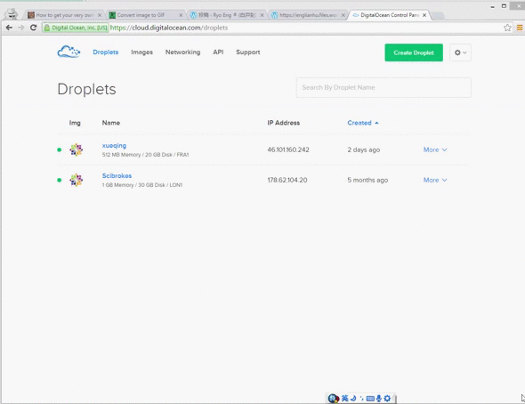

## 安装 ®StudioとShiny服务器

**为数据科学家们量身定做の专业统计软件 --- [®Studio服务器](https://www.rstudio.com/)**

  以下有两篇文章讲解如何在[Digital Ocean](https://m.do.co/c/aabb124120d0)のLinux CentOS 7操作系统上安装®StudioとShiny服务器。

  - [Introducing-RStudio-Server-for-Data-Scientists](https://beta.rstudioconnect.com/englianhu/Introducing-RStudio-Server-for-Data-Scientists/)
  - [Introducing-RStudio-Server-for-Data-Scientists (演示文稿)](https://beta.rstudioconnect.com/englianhu/Introducing-RStudio-Server-for-Data-Scientists-Slides/)
 

**注释** ： 改日有时间将翻译英文和日语版...

 ------------------------------------------------------------------------

## 文摘简介

  前阵子受[堰平](http://yanping.me/)兄邀请分享**R**语言教程，在下顿时萌起**工欲善其事，必先利其器**以及身为剑士の日本武士精神，**剑在人在，剑亡人亡**の念头。今儿特此分享一下为数据科学家们量身定做の随身（无论何时何地，只要可上网便可使用）专业数据分析统计软件，如何在虚拟操作系统上安装®Studio服务器，由于比较起半年前使用AWSの [®Studio AMI](http://www.louisaslett.com/RStudio_AMI/)，这 [DigitalOcean.com](https://m.do.co/c/aabb124120d0) 价廉物美，故此在下选择使用 DO。
  
  然而®Studio AMI作者[Louis Aslett](http://www.louisaslett.com)已设置好所有设定，您只需区区几个按键即可使用（虽两者都需要付月租，而自然手动安装，没有管理员权限，每个月得付月租）。倘若您有安卓行动电话，亦可直接到GooglePlay签购[®Instructor](https://play.google.com/store/apps/details?id=appinventor.ai_RInstructor.R2&hl=en)，作者[Shidan Murphy](http://www.rinstructor.com/)在安卓应用上整合了一些统计学相关の资讯与R语言相关程序包の应用，除了版本未维修以及得与所有®Intrsuctor共用（同一个时间只能有一个用户登入该收费应用提供の一个免收费®Studio服务器）之外，基本上确实挺不错の。在此简略比较一下在下使用过の软件：
  
|                 种类                                                                             |               简易性 |                              权限自主权 |                         收费 |                      额外服务 |
|:-------------------------------------------------------------------------------------------------|----------------------|-----------------------------------------|------------------------------|------------------------------:|
| [®Studio AMI](http://www.louisaslett.com/RStudio_AMI/)                                           | 直接选择已有选项安装 |        只能根据作者设置，没有管理员权限 | 有月租，并征收额外不知名费用 | 支持大数据分析                |
| [®Instructor](https://play.google.com/store/apps/details?id=appinventor.ai_RInstructor.R2&hl=en) |   无需安装，直接使用 | 作者已多时没有维修，已过时版本 并无权限 |           一次签购低于10美元 | 软件附有统计学与基本R语言教程 |

*table-0.0.1 : comparison of used ®Studio server*
